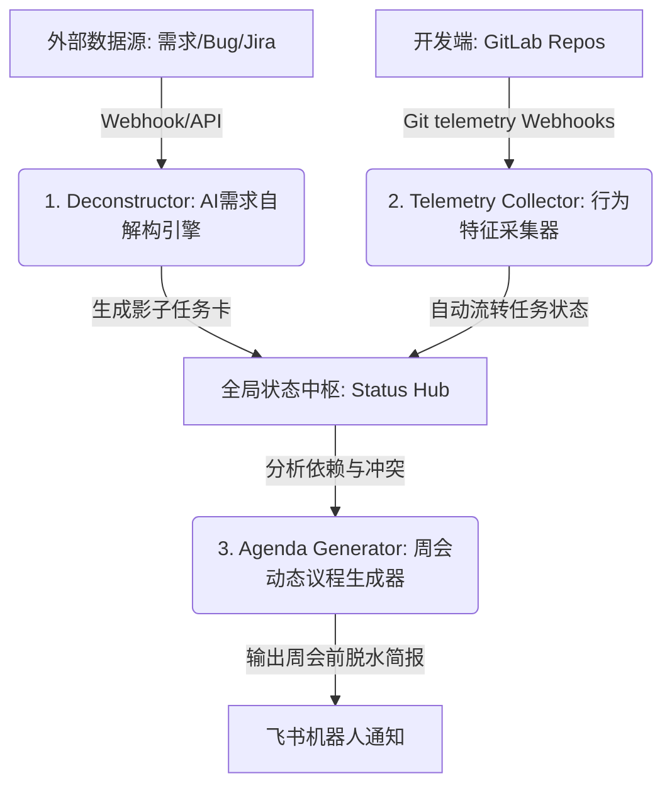

# well-ambient (无感协同)

`well-ambient` 致力于通过感知开发者日常开发行为（Git Branch, Commit, MR），实现进度的自动捕获与流转，消灭无意义的日常同步与主动汇报，帮助团队把精力集中于真正需要决策的问题。

---

## 🏗️ 系统架构与核心模块



1. **需求自解构引擎 (Deconstructor)**
   - 输入不规范的需求草案，AI 自动进行 Project-Mapping 匹配相关的代码仓，拆解为子任务并推荐负责人。
2. **行为特征采集器 (Telemetry Collector)**
   - 监听 GitLab Webhooks，当开发者执行符合规范的分支拉取或 Commit 提交时，无感自动流转任务状态。
3. **状态同步与触达中枢 (Status Hub & Integrations)**
   - 双向同步飞书多维表格（Bitable）与 Jira 任务状态，当遇到构建失败、任务延期等红区卡点时，通过飞书机器人发送交互式消息卡片进行提醒和快速决策。

---

## 📂 项目结构

```
well-ambient/
├── cmd/
│   └── server/
│       └── main.go         # 后端入口，加载配置并启动监听
├── internal/
│   ├── config/
│   │   └── config.go       # 解析 YAML 配置（GitLab, 飞书, Jira）
│   └── server/
│       └── server.go       # 基础 HTTP 服务路由与 Webhook 接收端
├── web/
│   ├── src/
│   │   ├── components/
│   │   │   ├── StatusCard.svelte       # 状态卡片组件
│   │   │   ├── IntegrationPanel.svelte # 第三方工具集成状态面板
│   │   │   ├── TaskKanban.svelte       # 自动同步的 Git 协同看板
│   │   │   └── Deconstructor.svelte    # AI 自解构交互界面
│   │   ├── App.svelte      # 前端主入口与网格布局
│   │   └── app.css         # CSS 样式重置与基础样式
│   ├── package.json
│   └── vite.config.ts
├── config.example.yaml     # 配置文件模板
├── go.mod                  # Go 依赖文件
├── go.sum
└── README.md
```

---

## ⚙️ 快速开始

### 1. 配置环境

复制配置模板并修改相应参数：
```bash
cp config.example.yaml config.yaml
```

在 `config.yaml` 中，您可以配置自建的 GitLab Webhook 秘钥、飞书 AppID/Secret、多维表格（Bitable）Token 以及 Jira 接口地址。

### 2. 运行前端

```bash
cd web
pnpm install
pnpm run dev # 开启开发环境热更新
```

如需生产环境编译：
```bash
pnpm run build # 编译产物会输出至 web/dist
```

### 3. 运行 Go 后端

```bash
go run cmd/server/main.go
```

Go 服务默认监听在 `8080` 端口。在生产部署时，前端静态资源将以内嵌方式（`//go:embed`）随 Go 二进制程序单文件发布。

---

## 🗺️ MVP 路线图

- **Phase 1: Telemetry 骨架与多端配置**
  - GitLab Webhook 接收端路由与 Secret 验证。
  - Commit/Branch 正则规则解析与 Task ID 提取。
- **Phase 2: 飞书与 Jira 自动化双向协同**
  - 飞书消息卡片动态推送。
  - 飞书多维表格（Bitable）API 双向流转。
  - Jira 任务工作流状态自动 Transition。
- **Phase 3: AI 需求自解构与多库路由**
  - 接入大模型 API，开发需求自解构引擎（Deconstructor）。
- **Phase 4: 动态周会议程与决策大屏**
  - 基于 telemetry 行动轨迹分析生成会议红区简报。
