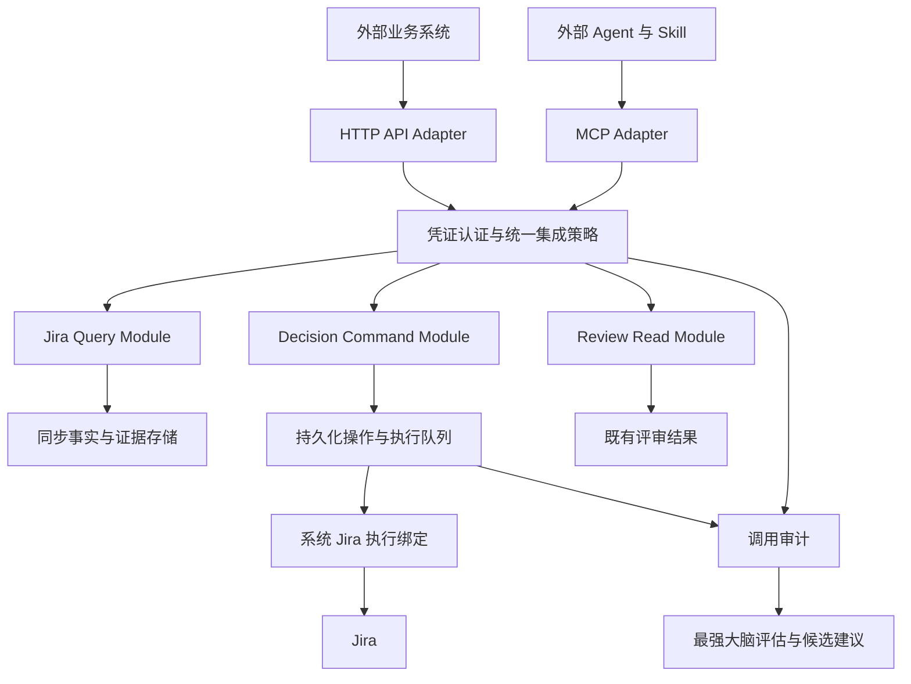

# 对外开放能力与最强大脑落地方案

日期：2026-09-26。状态：实施方案，尚未实施或部署。读者：领域负责人、后端开发、Agent 接入开发与运维。

## 1. 已确认的目标与决策

向外部业务系统和 Agent 开放三类能力：Jira 数据查询与统计分析、看板决策与 Jira 操作、Code Review 结果查阅。系统提供稳定业务接口，MCP 提供工具入口，Skill 提供使用方法。外部业务系统可直接调用 HTTP API。

用户已确认：

- 外部调用采用集成服务身份，API Key 由本系统签发与维护。
- API Key 对应的外部身份只标记来源；不模拟外部个人用户，不要求外部用户绑定 Jira 账号。
- 进入系统后，由系统统一映射 Jira 权限与执行身份。
- Code Review 本次只开放查阅，不扩大到触发评审、修改规则或发布评论。

本文将该身份模型落实为：所有有效集成来源使用系统统一的集成权限策略；API Key 生命周期与配额按来源管理，业务授权不按外部个人身份或来源名称推导。需要对不同来源设置不同业务权限时，必须作为后续显式模型变更，不能在首版偷偷加入。

这是方案文档，不授权签发真实密钥、修改 Jira、部署、迁移生产数据库或发送外部消息。已有工作区改动保留。本方案独立存放，不覆盖此前 Agent Runtime 路线或正在进行的部署工作。

## 2. 当前基线与真实缺口

以下结论来自当前工作区的定向代码检查，不是生产运行认证，也不是全库安全审计。

| 当前证据 | 可以复用 | 上线前必须补齐 |
| --- | --- | --- |
| `internal/server/jira_report_sync.go` 保存报告分类与历史字段 | 配置字段驱动的报告语义 | 对外统一查询、统计定义、完整性和时效契约 |
| `internal/server/strongest_brain_handlers.go` 的 `handleStrongestBrainIntervention` 先提交本地任务与决策事件，再启动 Jira 同步 | 决策动作及本地业务校验 | 持久化执行记录、远端结果核验、幂等与未知结果处理 |
| `meeting_note_synced` 当前表示已请求同步 | 现有页面兼容行为 | 新接口禁止把请求发起等同于 Jira 已确认成功 |
| `internal/server/code_review_handlers.go` 提供列表与详情 | 已有报告及运行数据 | 对外 DTO、明确的仓库发布范围、分页与字段裁剪 |
| `internal/agentruntime` 已有 Registry、Lockfile、Trace、Context Protocol 等代码 | 内部运行追踪与版本治理基础 | 核查哪些模块接入真实链路；不以模块存在证明端到端完成 |
| `internal/strongestbrain` 已有评估与建议模块 | 候选建议和评估入口 | 接入外部工具调用结果及业务质量指标 |

Jira 历史同步是否齐全、生产迁移是否完成、远端 Jira 版本与工作流能力，都需实施阶段验证。既有历史报告中的数量不作为本方案的当前数据基线。

## 3. 统一业务语言与领域责任

沿用仓库已有 `CONTEXT.md` 的项目、交付项、决策事项与证据定义。下表是本方案新增的拟议术语，实施时经领域确认后并入原有术语表，不另建一套项目身份体系。

| 术语 | 定义与约束 |
| --- | --- |
| 集成来源 Integration Source | 使用开放能力的外部系统，用于溯源、配额和运行统计，不代表 Jira 用户 |
| 集成凭证 Integration Credential | 系统签发的访问凭证；一个来源可同时持有轮换中的多个凭证 |
| 集成权限策略 Integration Access Policy | 系统对集成入口统一配置的项目、仓库、动作、字段及数据发布规则 |
| Jira 执行绑定 Jira Execution Binding | 系统按项目与动作选定 Jira 连接器和服务执行身份的映射；密钥不对外返回 |
| 查询快照 Query Snapshot | 具有查询条件、口径、数据截止时间与完整性标记的一次事实视图 |
| 决策方案 Decision Plan | 针对确切事项和前置状态生成的变更方案，具有有效期与内容摘要 |
| 执行操作 Operation | 对一个决策方案的持久化执行实例，具有可查询、可核验的结果 |
| 评审报告 Review Report | 针对确切代码版本产生的发现、证据和覆盖情况，不代表当前分支永久有效 |
| 能力契约 Capability Contract | 对外承诺的输入、输出、错误、授权规则和兼容版本 |

领域责任如下：

| Module | 拥有的规则 | 不承担的职责 |
| --- | --- | --- |
| Integration Access | 凭证认证、统一策略、来源审计、配额、执行绑定 | 不解释 Bug 分类，不生成模型结论 |
| Jira Query | 筛选、统计口径、历史语义、来源与完整性 | 不直接执行决策写入 |
| Decision Command | 方案、前置条件、操作生命周期、远端确认 | 不把模型建议直接视为权限 |
| Review Read | 报告查询、版本对应关系、证据视图、可发布字段 | 不触发或发布评审 |
| Agent Runtime | 内部 Agent 的版本、预算、工具调用追踪 | 不替代上述领域的确定性校验 |
| Strongest Brain | 使用效果分析、候选建议、离线评估 | 不自行扩大权限、签发密钥或激活生产策略 |

优先保持模块化单体。HTTP、MCP 和已有页面调用相同应用层接口；不为开放入口复制 Jira 规则。MCP 是协议 Adapter，Skill 是流程包，领域 Module 是稳定业务实现。

## 4. 接入与身份架构

### 4.1 系统统一授权

每次执行的允许范围为：系统集成策略允许范围 ∩ 系统映射的 Jira 执行身份实际权限 ∩ 事项当前工作流约束。查询缓存时同样应用系统数据发布策略；不能认为缓存里存在的数据就可以对外公开。

不接受请求中的 actor、source_name、Jira 用户名或 `x-authenticated-user-*` 作为可信身份。可信来源由 API Key 解析获得；外部传入的终端用户标识如需保留，仅记为未经认证的来源元数据，不参与授权。

所有有效 Key 首版共享统一业务策略，这意味着策略允许的数据对所有集成来源一致可见。若某来源不适合获得该范围，应先收紧统一范围或暂停接入，不把“来源仅溯源”偷偷变成按来源的角色模型。

Jira 的事项安全级别和敏感字段必须纳入统一发布策略。若本地缓存不能可靠判断可发布性，应排除对应记录或实时核验，不能仅凭项目级权限放行。Code Review 单独使用系统仓库发布规则；Jira 项目与仓库关系必须来自权威映射，不能靠名称推断。

### 4.2 API Key 生命周期

- 管理入口由已有系统管理员身份保护，开放 Key 不得签发、查看或轮换其他 Key。
- 凭证采用高熵随机秘密；保存可索引的 Key ID 与验证摘要，不保存可再次展示的明文。
- 首次签发仅展示一次；后续只能查看前缀、来源、状态、过期时间与使用记录。
- 支持签发、禁用、撤销、过期与轮换；短期双 Key 重叠用于平滑迁移。
- 请求经 TLS 传输；密钥放认证头，不放 URL、Skill、代码仓库、Trace 或错误响应。
- 限流和并发配额按可信来源归并，不能通过多个轮换 Key 绕过来源配额。
- 撤销后拒绝新调用；排队写操作在发送前重新校验来源、凭证状态和当前策略。已经发送的远端操作继续核验，不能当作已取消。

### 4.3 MCP 客户端兼容

首版提供远程 HTTP MCP 入口，针对能配置自定义认证头的目标客户端验证 API Key 直连。API Key 认证是产品接入约定，不能声称它天然等价于 MCP 标准 OAuth 授权流程。

对不支持该认证方式、但支持本地 stdio MCP 的客户端，可提供本地桥接程序：从环境或安全凭证存储加载系统 Key，转发至同一开放 API。桥接不转发任意 URL，不在标准输出打印日志或密钥。

仅当目标客户端实际需要时，再增加兼容的 OAuth 接入层；其业务身份仍映射为系统集成服务，不要求外部个人 Jira 授权。首版退出条件是两个已选定目标客户端通过接入验证，不承诺所有客户端即插即用。实际客户端名称在实施启动时登记，不凭空假定。

## 5. 对外能力与契约

建议入口：`/open/v1/...` 和 `/mcp`。它们是拟议路由，尚未实现。统一错误至少区分 unauthenticated、forbidden、invalid_query、stale_plan、rate_limited、upstream_unavailable 和 outcome_unknown；不得泄露上游凭证、内部 SQL 或无权资源存在性。

### 5.1 Jira 查询和分析

| MCP 工具 | 输入重点 | 返回内容 |
| --- | --- | --- |
| `jira_describe_schema` | 项目或统一范围 | 可用字段、维度、指标、类型、时间语义、口径版本 |
| `jira_search_issues` | 结构化筛选、字段、排序、cursor、limit | Issue 摘要与分页信息 |
| `jira_get_issue` | Issue Key、按需包含历史 | 详情、关联事项、变更历史、来源与缺失信息 |
| `jira_aggregate_issues` | 筛选、指标、group_by、时间桶 | 后端完整计算的统计、口径、下钻引用 |

首版覆盖 Bug/任务当前数量、状态分布、负责人分布、权威 Bug 分类、优先级、到期与逾期、缺失负责人/分类等数据质量指标。新增、解决、重开、历史负责人及状态停留时间按历史完整性启用；未满足条件返回不可计算或部分结果，不编造零值。

查询规范：

- 使用白名单字段和操作符；首版不开放任意 SQL 或不受控原始 JQL。
- 系统强制附加统一发布范围；排序、导出、分组、总数与下钻都使用相同规则。
- 区分当前库存、期间事件次数、期间去重事项数；“解决次数”和“解决 Issue 数”是不同指标。
- 明确时间基准、时区、半开时间区间、当前/历史负责人语义、子任务计数方式。
- Bug 分类读取配置的权威字段；不能从标题、当前负责人或项目名称推断分类。
- 历史不完整时，受影响的指标不参与看似完整的汇总；返回缺失比例或无法确定的原因。
- 列表采用稳定排序与有界 cursor；详情历史独立分页，避免返回无限上下文。
- 统计由后端针对完整授权集合执行，不能让模型将当前页作为总体。
- 限制分组维度、时间跨度、桶数与查询预算；超限明确拒绝或转异步任务，不能静默截断成精确统计。

响应公共元数据建议为：`request_id`、`schema_version`、`policy_version`、`metric_definition_version`、`data_as_of`、`query_snapshot_ref`、`completeness`、`missing_reasons`、`source_refs`。混合来源返回分来源水位；分页/下钻引用保留原条件与快照语义，不能下钻到另一个时刻的数据而不告知。

模型产生的解释与统计事实分别返回。每条分析结论引用指标或 Issue 证据；没有模型也能使用全部查询工具。

### 5.2 看板决策与写入

| MCP 工具 | 职责 |
| --- | --- |
| `decision_get_context` | 返回事实、风险、最近变更和系统允许的动作 |
| `decision_prepare` | 冻结目标、变更前后值、证据、前置条件、有效期与内容摘要 |
| `decision_execute` | 接受 plan_id 和幂等键，执行确切方案，不接受另加变更参数 |
| `decision_get_operation` | 返回各动作状态、远端确认事实及后续处理建议 |

首版只支持单 Issue 转派与改期。随后加入评论、工作流流转和有界批量；本地仓库关联不属于 Jira 写操作，不混入同一动作枚举。

prepare 是服务端校验与可审阅产物，不等于每次人工审批。系统策略可对明确范围预先授权自动执行；需要审批的动作必须取得系统保存的真实审批记录，不能接受模型传入 `approved=true`。方案绑定可信集成来源、目标、内容摘要、有效期和审批策略。

execute 必须重新验证当前策略、映射和方案前置条件。Key 轮换后同一来源可以继续查询或执行有效方案；Key 本身只用于认证。来源暂停则禁止新的写入。策略收紧优先于旧方案授权快照。

执行状态：`accepted → queued → dispatching → succeeded | failed | unknown`。批量父操作额外支持 `partial`，子动作各自有结果。succeeded 必须有 Jira 确认；本地事件提交、HTTP 202、请求已发出均不是远端成功证据。

本地事务同时保存 Operation 和 Outbox，worker 以租约领取，远端调用后持久化确认结果。提交本地事务与调用 Jira 无法形成一个数据库原子事务；不得承诺 exactly-once。崩溃发生在远端完成、本地未确认之间时，恢复为待核验，不盲目重发。

幂等键按来源与接口作用域唯一绑定请求摘要：同键同内容返回原操作，同键不同内容返回冲突。队列重试只对确认可安全重试的动作执行。评论超时尤其需要核对远端评论身份，无法确认则保留 unknown，不能自动重复发表评论。

转派、改期在发送前重读相关字段，执行后读取确认值。若 Jira 版本不支持原子条件更新，重读并不能消除与外部操作者的竞争；需记录此限制、发现冲突后停止后续动作并核对，不能声称完全防止丢失更新。

领域中保留 desired_value 与 confirmed_remote_value；旧界面可以兼容显示待同步状态，但不能让尚未确认的期望值成为已生效事实。迁移期间同一业务动作只能由一个发送者处理，禁止旧 goroutine 与新 worker 双发。

### 5.3 Code Review 查阅

| MCP 工具 | 职责 |
| --- | --- |
| `review_search` | 按授权仓库、MR、分支、SHA、状态、时间分页查找报告 |
| `review_get` | 获取报告、按严重性/类别/文件筛选发现，并按需分页加载证据 |

报告返回 run_id、repository、MR、base_sha、head_sha、reviewed_at、run_status、coverage_gaps、findings 与 evidence_refs。区分 completed、partial、failed；没有发现不代表完成了评审。

代码新鲜度用 `matches_current_head / outdated / not_checked` 表达，并记录核验时间。不能仅按“最新报告”推断对应当前代码。摘要、文件路径、片段和证据下载都受系统仓库发布策略约束。

不返回模型原始请求、系统 Prompt、凭证、内部堆栈或未经筛选的运行元数据。不在本次开放触发、重试、取消或发布评审。

## 6. Skill 与 Agent 架构

交付三个标准 Skill 包：

| 包 | 使用流程 | 成功条件 |
| --- | --- | --- |
| `jira-analysis` | 发现字段口径 → 查询/聚合 → 下钻 → 汇总 | 数字来自后端；解释附来源；声明历史缺口 |
| `board-decision` | 获取上下文 → prepare → 按策略执行 → 查询操作结果 | 准确区分建议、已受理和远端已生效 |
| `code-review-reader` | 定位代码版本 → 找报告 → 阅读发现和证据 | 说明报告版本、完成度与适用性 |

每个包包含 SKILL.md、输入输出示例、错误处理与工具兼容说明。正文只保留流程，详细指标说明按需加载；不嵌入密钥、环境地址或整套业务规则。分发包记录版本和内容摘要，声明兼容的工具契约版本。

外部 Agent 的任务规划由外部宿主完成；本系统不能声称控制或完整审计其思维、模型版本、全部 token 成本或 Skill 实际执行情况。客户端声明的 Skill 版本属于来源声明，与系统可验证的工具版本分开记录。

内部最强大脑可使用同一组应用层能力，通过服务端注入的受控执行上下文调用，不能伪造一个任意外部来源绕过策略。模型仅提出解释和方案；字段校验、统计、授权、幂等和远端核验均由确定性代码执行。

复用既有 Registry 记录能力描述和版本，但首版采用静态工具映射，不依赖任意插件加载或复杂依赖解析。外部工具调用只需 Invocation 记录，不必强行创建 AgentRun；内部 AgentRun 通过关联 ID 连接 Invocation 与 Operation。

## 7. 最强大脑如何形成改进闭环

输入分为三类：服务端可验证的调用事实、已确认的业务执行结果、外部反馈。反馈可以评估使用体验，但不得直接覆盖权威统计或充当写操作成功证明。

指标：

- 查询：口径一致率、完整性、下钻可复核率、延迟、超预算/超限率。
- 决策：方案冲突率、远端确认成功率、unknown 数量与持续时间、重复副作用数量。
- 评审查阅：报告定位正确率、过期报告识别率、证据访问成功率。
- 接入：鉴权失败、限流、协议错误、客户端兼容结果。
- 模型效果：有人工或外部可解释反馈时统计建议采纳、误报、遗漏；无反馈时标记未知。

优化顺序：正确性与权限硬门禁 → 证据完整性 → 稳定性 → 成本和延迟。首版不建立可用低成本抵消错误结果的综合分数。

闭环为：异常聚类 → 候选契约/Skill/查询建议 → 保存样本离线评估 → 人工选择 → 限定范围试用 → 比较指标 → 发布或撤回。最强大脑不自动修改集成权限、Jira 执行身份、密钥或写操作策略。

离线重评使用保存的输入与工具结果，不发送真实 Jira 写请求。生产写操作不做新旧双执行；只允许影子生成方案并比较，真实执行保持单一权威路径。

## 8. 最小数据模型与接口边界

| 记录 | 关键字段与约束 |
| --- | --- |
| IntegrationSource | id、name、status、owner、quota_profile；来源名称不参与业务授权 |
| IntegrationCredential | key_id、source_id、verifier、status、expires_at、revoked_at；秘密仅首次展示 |
| IntegrationPolicyVersion | version、allowed_projects、allowed_repositories、actions、field_rules、approval_rules、digest；统一策略版本 |
| JiraExecutionBinding | project_ref、action_class、connector_ref、executor_ref、version；凭证保存为安全引用 |
| DecisionPlan | source_id、target、changes、preconditions、policy_version、expires_at、digest、approval_ref |
| Operation / OperationAction | plan_id、source_id、idempotency_key、request_digest、state、remote_evidence、last_error |
| Outbox | operation_action_id、lease、attempt、next_attempt_at；持久化领取与恢复 |
| CapabilityInvocation | request_id、source_id、key_id、tool_version、policy_version、target_refs、duration、outcome；敏感参数裁剪 |

Query Snapshot 和 Review Report 优先复用已有证据/数据资产存储，不重复复制大块原始数据。是否复用现有审计表与配置版本表，在实施核验后确定；上表表达逻辑模型，不要求逐项新建物理表。

HTTP 建议为 `/open/v1/jira/schema`、`/jira/issues`、`/jira/aggregations`、`/decisions/context`、`/decisions/plans`、`/decisions/executions`、`/operations/{id}`、`/reviews` 与 `/reviews/{id}`，后续路径均相对 `/open/v1`。由 OpenAPI 明确具体方法、schema 和错误语义；MCP 从同一契约映射，避免维护两套业务解释。

管理端签发/轮换接口不放在 MCP 工具目录内。管理 UI 可后续接入已有设置体系；如需改 UI，实施时必须另行完成项目三方 UI 门禁。

## 9. 分阶段实施与验收

本文编号可直接作为开发任务拆分依据；不自动创建外部工单或选择新的跟踪器。

| 阶段 | 工作包 | 依赖 | 交付和退出条件 |
| --- | --- | --- | --- |
| P0 真实基线 | 核验 Jira 版本、连接器权限、数据水位、项目/仓库映射；冻结指标与两个目标客户端 | 无 | 契约清单、数据缺口清单、代表性样本；不以历史笔记冒充现状 |
| P1 统一集成入口 | Key 生命周期、统一策略、执行绑定、审计、限流、错误契约 | P0 | 撤销/轮换/伪造来源/无权范围验证通过；提供管理 API 或 CLI，无需先做 UI |
| P2 只读最小产品 | Jira 四工具、Review 两工具、两个 Skill、HTTP 与 MCP Adapter | P1 | 两个目标客户端成功接入；查询统计与权威样本一致；评审版本和缺口表达正确 |
| P3 单事项决策闭环 | prepare/execute/operation、持久化队列、单 Issue 转派改期、第三个 Skill | P1、P2 的事实接口 | 重复请求、前置冲突、超时未知、撤销、崩溃恢复验证通过；只有远端确认才成功 |
| P4 有界扩展 | 评论、实际工作流流转、有限批量、异步大查询 | P3 | 子动作逐项核验；不重复评论；部分失败可解释；不承诺跨 Issue 原子性 |
| P5 效果治理 | Invocation 接入最强大脑、样本重评、候选与版本发布 | P2 起采集，P3 后评估写链路 | 可用真实调用证据证明收益；无权限、口径和副作用回归 |

P2 是只读最小可用版本，P3 才覆盖用户提出的全部三类业务范围；不能以只读版本交付宣称整个需求完成。P0 后按确认的接口与数据缺口估算工期，不沿用此前内部 Runtime 全量平台的工程日估算。

建议代码落点：`internal/openaccess`、`internal/jiraquery`、`internal/decisioncommands`、`internal/reviewread` 与一个 `internal/openmcp` Adapter。名称为建议；已有 Module 满足契约时原地扩展，不为了目录完整而建立透传层。

### 9.1 必测场景

1. 已撤销、过期和随机 Key 均拒绝；伪造 source/actor header 不改变身份；轮换重叠有明确到期。
2. 统一策略外的项目、受限 Issue、仓库、统计总数、下载引用均不可泄露。
3. 当前状态统计与期间解决事件不混用；历史缺失不计为零；重开/子任务/跨时区边界有权威样本。
4. HTTP 与 MCP 相同请求返回相同业务事实与口径；cursor 与下钻保持范围和时间语义。
5. 执行前字段变化返回方案冲突；同幂等键不同请求拒绝；同请求不重复发出动作。
6. 远端成功后 worker 崩溃能进入核验恢复；远端超时不报成功也不盲重试。
7. 策略收紧或来源停用后，旧方案和排队操作不能继续扩大权限；已经发送的操作继续核验。
8. 旧 goroutine 与新 worker 不会双发；停用新入口不会丢失已受理操作。
9. partial/failed 报告不显示为通过；旧 SHA 报告不冒充当前版本；原始 Prompt 与凭证不对外返回。
10. Skill 面对字段缺失、工具不可用和 unknown 时按契约停止或说明，不自行补写事实。

### 9.2 发布与回退

按模块设置独立开关：只读入口、决策 prepare、决策 execute。先本地与测试环境验证，再按明确授权接入生产。读能力可做结果影子比较；写能力只做方案影子比较。

回退时停止接收新执行请求，继续处理已受理记录的确认与审计。不得删除 Operation/Outbox 来“回滚”，也不能重新开启旧发送路径造成重复写入。已完成 Jira 操作只能通过新的补偿方案处理，恢复负责人/日期前重新核查当前值；评论和流转不能承诺通用可逆。

## 10. 与现有技术路线的关系

此前 [Agent Runtime 路线](agent-runtime-capability-plan-2026-09-24/01-execution-roadmap.md)继续负责内部运行治理。本方案新增面向外部消费者的产品路线，两者共享领域能力与追踪关联，不要求先完成内部全量平台才能发布 MCP。

保留：版本化契约、按需加载、冻结内部运行依赖、证据链和候选评估。

前移：统一身份与权限映射、API Key 生命周期、公开 DTO、查询口径、真实客户端接入、写操作结果核验。

延后：动态插件沙箱、任意能力装载、复杂依赖解析、自动优化激活、多服务拆分。

这次交付仅包含方案。API Key 管理、MCP Server、Skill 包、数据迁移和自动化测试均为后续实施产物，不冒称已有。

## 11. 依据与待验证项

- [现有领域语言](../CONTEXT.md)。
- [现有领域收敛计划](strongest-brain-delivery-domain-convergence-execution-plan.md)。
- [现有 Agent Runtime 领域模型](agent-runtime-capability-plan-2026-09-24/02-domain-and-schema.md)。
- [Agent Skills 规范](https://agentskills.io/specification)：Skill 包结构和按需加载。本文业务契约是项目设计，并非规范要求。
- [MCP 授权规范，2025-11-25 固定版本](https://modelcontextprotocol.io/specification/2025-11-25/basic/authorization)：用于核对 HTTP 授权互操作与 API Key 自定义接入的差别，不据此宣称已选定最新协议版本。实际协议/SDK 版本在 P0 按目标客户端锁定。
- [Jira Data Center Issue API](https://developer.atlassian.com/server/jira/platform/rest/v10005/api-group-issue/)：用于说明工作流流转需查询具体 Transition；实际实例版本与能力仍须核验。

剩余实施输入：首批集成客户端、系统统一允许的项目/仓库范围、Jira 执行绑定、需要审批的动作边界、Key 有效期与配额、审计与快照保留期。这些都是系统配置和验收参数，不再重新询问已经确认的集成服务身份方向。
