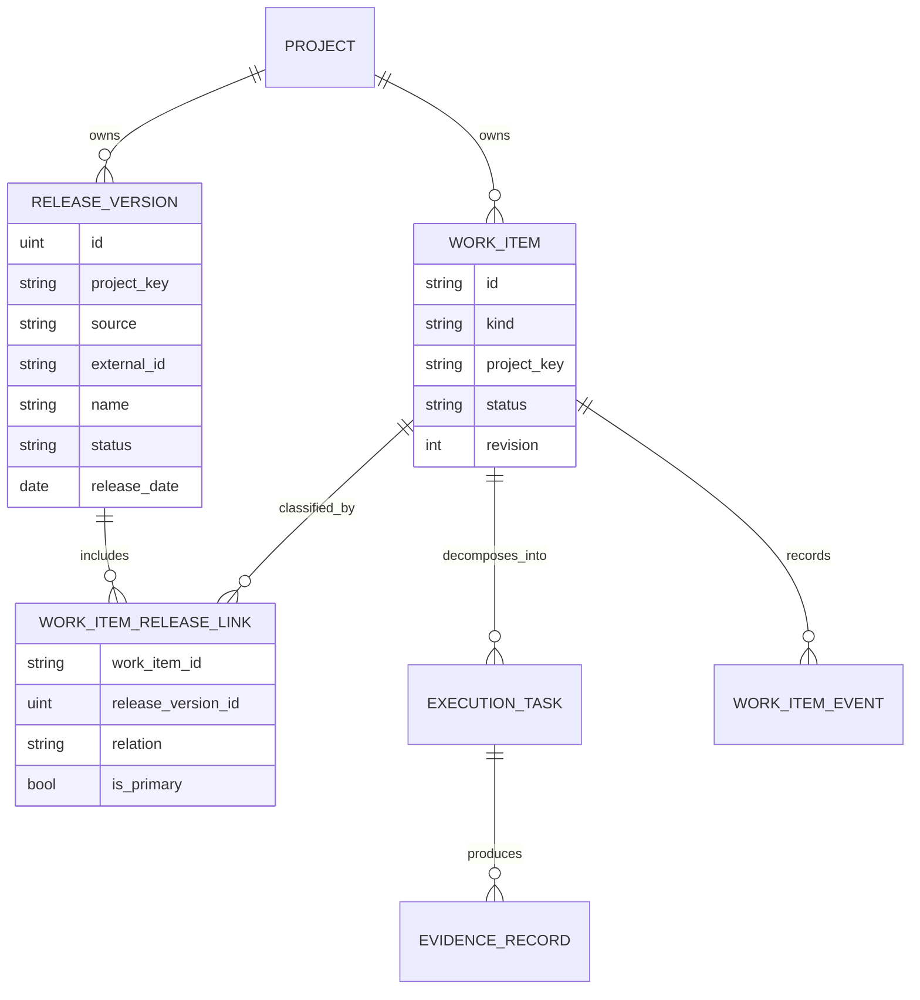

# 最强大脑：项目、版本、交付项与页面收敛执行计划

## 0. 文档状态

- 状态：待评审、可执行
- 范围：`well-ambient`
- 目标：把项目、版本、需求、缺陷、执行任务的领域关系变成可持久化、可同步、可审计的交付闭环，并按业务问题收敛重复页面
- 实施原则：先建立事实与唯一写入口，再切换读模型，最后删除重复入口
- 本计划不授权生产数据迁移、Jira 写回或部署；每个动作必须在对应 Phase 的门禁通过后单独执行

## 1. 最终结果

实施完成后，系统应满足以下结果：

1. 每个进入正式排期的需求或缺陷都有明确项目。
2. 每个进入发布承诺的需求或缺陷都有明确的主目标版本。（版本应该主要是针对名称为“FMS”的项目，同时不应该存在必须绑定的问题）
3. 缺陷的受影响版本和目标修复版本被分别记录。
4. 多个 Jira `fixVersion` 不再被静默猜测为一个主版本，而是进入待澄清异常。
5. 执行任务只能作为需求或缺陷的子级执行证据，不再独立占用版本承诺列表。
6. 同一个业务对象只有一个主写入口；其他页面只能使用共享读模型或跳转到主写入口。
7. 决策中心只展示异常和需要人处理的问题，不重新制造通用任务队列。
8. 项目偏好只控制个人可见范围，不再被误用为项目归属。
9. Jira 同步范围配置继续存在，但与业务版本归属明确分离。
10. 所有项目/版本变更都有操作者、原因、前后值、同步状态和回放记录。

## 2. 当前基线与问题

### 2.1 已有能力

- `ProjectConfig` 已提供项目目录、优先级、阶段和仓库映射。
- Jira `version_sources` 已能从版本页解析项目和版本 ID，并生成附加 `fixVersion` JQL。
- `TaskTelemetry` 已承载需求、缺陷、执行任务、负责人、状态、截止日、分支和 MR 等事实。
- `/api/schedule` 已将需求和缺陷作为排期对象，并聚合影子任务进度。
- `/api/execution/tasks` 已聚合任务、commit、MR 和证据风险。
- 决策看板、每日 Jira、项目健康、KPI、证据链均已有可复用读模型。
- 项目偏好已经由后端与权限范围求交集。

### 2.2 结构性问题

1. `version_sources` 只决定“同步哪些 Jira”，不保存交付项的版本归属。
2. Jira issue DTO 没有读取 `fixVersions` 和 `versions`。
3. `TaskTelemetry` 没有显式 `project_key`、父交付项、修订号等字段。
4. 项目过滤仍大量依赖 Jira Key 前缀，项目名称又被暂存到 `Repo`。
5. `issue_type = bug` 同时进入排期和执行追踪，业务身份不稳定。
6. `TaskKanban` 能同时看到需求、缺陷和任务，导致“执行任务”边界不够硬。
7. 决策事项、每日 Jira、执行追踪、证据链、项目健康和 KPI 之间存在数据重叠。
8. 写入逻辑分散在需求创建、排期、Jira worker、Override 等处理器中，生命周期规则没有统一模块。

### 2.3 必须保留的既有约束

- Jira `Task/Story/Feature/Epic/Requirement` 归一为需求。
- Jira `Bug/Defect/缺陷/故障` 归一为缺陷。
- AI 或人工拆分的子项归一为执行任务。
- 口头需求在草稿阶段允许暂不指定项目。
- 个人项目偏好默认全部项目，并与权限、核心成员范围、页面筛选求交集。
- 当前产品采用浅色、表格优先、右侧检查器的管理台基线。
- 流转视图与排期表可以共享数据，但保留不同展示方式。
- 不恢复已被证明无价值的“最强大脑通用决策队列”。

## 3. 范围与非目标

### 3.1 本次范围

- 项目显式归属。
- 发布版本目录及版本状态。
- 需求/缺陷与版本关系。
- 缺陷受影响版本与目标修复版本。
- 需求/缺陷与执行任务父子关系。
- 统一交付计划模块与读模型。
- Jira 版本同步和可控写回。
- 页面收敛和导航调整。
- 权限、审计、迁移、兼容、监控和浏览器验证。

### 3.2 本次非目标

- 不在 v1 实现跨项目发布列车。
- 不引入完整 Sprint/敏捷规划系统。
- 不把仓库当成项目。
- 不让执行任务直接绑定发布版本。
- 不一次性删除 `TaskTelemetry`。
- 不一次性重写全部 Svelte 大组件。
- 不以 AI 推断替代项目或主目标版本的人为确认。
- 不抓取 Jira 版本页面 HTML。
- 不在未验证幂等性、冲突策略和回滚前启用 Jira 双写。

## 4. 目标领域模型



在迁移期，`WorkItem` 与 `ExecutionTask` 是 `deliveryplanning` 模块对外提供的领域对象，底层仍可由增量扩展后的 `TaskTelemetry` 保存；调用方不应再直接依赖该兼容表的混合语义。

### 4.1 强制不变量

1. `WorkItem.kind` 只能是 `requirement` 或 `bug`。
2. `ExecutionTask` 必须通过显式 `parent_work_item_id` 指向一个交付项。
3. 一个正式排期中的交付项必须有且只有一个项目。
4. 一个发布版本只能属于一个项目。
5. 交付项与目标版本必须属于同一项目。
6. 一个交付项最多只有一个 `is_primary = true` 的目标版本。
7. Bug 可以关联多个受影响版本。
8. 需求不能关联受影响版本。
9. 已关闭或已发布版本默认不能新增交付项。
10. 项目或版本变更必须提供 `reason`，并使用乐观并发修订号。
11. 项目偏好不能修改任何交付项归属。
12. AI 可以提出项目/版本建议，但不能在无人工确认时完成正式承诺。

### 4.2 生命周期门禁

| 阶段 | 项目 | 主目标版本 | 允许操作 |
|---|---|---|---|
| `draft` | 可空 | 可空 | 编辑、AI 解构、补充上下文 |
| `ready` | 必填 | 可空 | 估算、负责人确认、进入待排期 |
| `planned` | 必填 | 可空 | 截止日、容量、执行入口 |
| `committed` | 必填 | 必填 | 纳入版本承诺、版本风险计算 |
| `in_progress` | 必填 | 继承承诺 | 执行跟踪、证据回流、调停 |
| `verification` | 必填 | 保留 | 测试、验收、回归 |
| `done` | 必填 | 保留 | 归档、复盘、估算校准 |
| `archived` | 保留历史 | 保留历史 | 只读和审计 |

### 4.3 Jira 多版本规则

- Jira 无 `fixVersion`：交付项进入“未归版本”。
- Jira 只有一个 `fixVersion`：自动建立主目标版本关系。
- Jira 有多个 `fixVersion`：
  - 全部版本都保存为外部目标关系。
  - 如果已有人工确认的主版本且仍在列表中，保留主版本。
  - 否则不自动选择主版本，产生 `ambiguous_target_release` 异常。
- Jira Bug 的 `versions` 保存为受影响版本。
- 本地人工确认主版本后，是否写回 Jira 由显式同步策略决定。

## 5. 目标模块与接口

### 5.1 新增深模块：`internal/deliveryplanning`

该模块负责隐藏以下复杂性：

- Jira 类型到交付项类型的归一化。
- 项目解析与生命周期门禁。
- 发布版本目录和关系校验。
- 多版本歧义处理。
- 乐观并发控制。
- 事件追加。
- 同步任务生成。
- 交付计划、版本快照和异常读模型。

建议外部接口：

```go
type Module interface {
    ReconcileExternalIssue(ctx context.Context, snapshot ExternalIssueSnapshot) (WorkItemSnapshot, error)
    ApplyPlanningChange(ctx context.Context, command PlanningCommand) (WorkItemSnapshot, error)
    QueryPlan(ctx context.Context, query PlanQuery) (PlanSnapshot, error)
    QueryRelease(ctx context.Context, query ReleaseQuery) (ReleaseSnapshot, error)
}
```

接口约束：

- 调用者不自行解析项目 Key、不直接写版本关系、不自行追加审计。
- `ApplyPlanningChange` 原子完成校验、主数据更新、事件追加和同步 outbox 创建。
- 所有规则通过该接口测试，不在 HTTP handler 或 Svelte 调用方重复实现。

### 5.2 外部系统 seam

```go
type IssueTrackerPort interface {
    ListProjectReleases(ctx context.Context, projectKey string) ([]ExternalRelease, error)
    LoadIssueVersionState(ctx context.Context, issueKey string) (ExternalIssueVersionState, error)
    UpdateIssueVersionState(ctx context.Context, command IssueVersionUpdate) error
}
```

适配器：

- 生产：Jira HTTP adapter。
- 测试：内存 fake adapter。

### 5.3 兼容适配

- `/api/tasks` 在迁移期间继续返回兼容结构。
- `/api/schedule` 内部切换到 `deliveryplanning.QueryPlan`，路径暂不删除。
- `/api/execution/tasks` 只返回执行任务和执行证据。
- 原 `DecisionEvent` 只作为历史适配源；新规划变更写入结构化 `WorkItemEvent`。
- 全局事件中心在过渡期合并读取旧事件与新事件，不进行双写。

## 6. 数据模型

### 6.1 `TaskTelemetry` 增量字段

第一阶段保留该表，增加：

| 字段 | 类型 | 说明 |
|---|---|---|
| `project_key` | string, index | 显式项目归属 |
| `source` | string, index | `jira/local/ai/import/gitlab` |
| `external_key` | string, index | Jira Key 等外部身份 |
| `parent_work_item_id` | string, index | 执行任务父交付项 |
| `revision` | uint | 乐观并发版本 |
| `planning_state` | string, index | `draft/ready/planned/committed/...` |

约束：

- 新代码停止把 Jira 项目名称写入 `Repo` 作为项目事实。
- `Repo` 仅表示代码仓库或仓库映射。
- 新读路径停止从 `task_id` 前缀推导项目；兼容回退只保留到迁移完成。

### 6.2 `ReleaseVersion`

建议字段：

- `id`
- `project_key`
- `source`: `jira/local`
- `external_id`
- `name`
- `description`
- `status`: `planned/released/archived`
- `start_date`
- `release_date`
- `source_url`
- `synced_at`
- `created_at`
- `updated_at`

唯一约束：

- `(project_key, source, external_id)`
- 本地版本没有外部 ID 时使用稳定本地标识。

### 6.3 `WorkItemReleaseLink`

建议字段：

- `id`
- `work_item_id`
- `release_version_id`
- `relation`: `target_fix/affected`
- `is_primary`
- `source`: `jira/local/manual`
- `confirmed_by`
- `confirmed_at`
- `created_at`
- `updated_at`

唯一约束：

- `(work_item_id, release_version_id, relation)`

业务约束：

- 通过事务保证一个交付项最多一个主目标版本。
- `affected` 仅允许 Bug。

### 6.4 `WorkItemEvent`

建议字段：

- `id`
- `work_item_id`
- `project_key`
- `event_type`
- `actor`
- `reason`
- `before_json`
- `after_json`
- `revision`
- `source`
- `sync_state`
- `created_at`

关键事件：

- `project_assigned`
- `project_changed`
- `target_release_assigned`
- `target_release_changed`
- `affected_release_changed`
- `planning_state_changed`
- `release_scope_conflict_detected`
- `external_sync_failed`
- `external_sync_reconciled`

### 6.5 `WorkItemSyncOperation`

用于安全 Jira 写回：

- `id`
- `idempotency_key`
- `work_item_id`
- `operation`
- `payload_json`
- `status`: `pending/running/succeeded/failed/cancelled`
- `attempt_count`
- `last_error`
- `next_attempt_at`
- `created_at`
- `updated_at`

禁止直接在 HTTP 请求事务中同时写本地 DB 和 Jira。

## 7. HTTP 接口计划

### 7.1 发布版本目录

| 方法 | 路径 | 权限 | 说明 |
|---|---|---|---|
| GET | `/api/projects/{project_key}/releases` | `delivery:read` | 查询项目版本 |
| GET | `/api/releases/{id}` | `delivery:read` | 版本详情与范围快照 |
| POST | `/api/projects/{project_key}/releases/sync` | `release:manage` | 从 Jira 同步版本目录 |
| POST | `/api/projects/{project_key}/releases` | `release:manage` | 创建本地版本 |
| PATCH | `/api/releases/{id}` | `release:manage` | 修改名称、日期、状态 |

### 7.2 交付计划

| 方法 | 路径 | 权限 | 说明 |
|---|---|---|---|
| GET | `/api/work-items` | `delivery:read` | 项目/版本/类型/状态/风险筛选 |
| GET | `/api/work-items/{id}` | `delivery:read` | 交付项详情 |
| PATCH | `/api/work-items/{id}/planning` | `delivery:plan` | 项目、版本、排期、负责人原子变更 |
| POST | `/api/work-items/bulk-planning` | `delivery:plan` | 批量归版本或移出版本 |
| GET | `/api/releases/{id}/snapshot` | `delivery:read` | 容量、风险、范围变更、完成度 |
| GET | `/api/delivery/exceptions` | `decision:read` | 未归项目、未归版本、多版本歧义、同步失败 |

`PATCH /planning` 请求至少包含：

```json
{
  "expected_revision": 7,
  "project_key": "PRJ25024",
  "primary_target_release_id": 13622,
  "affected_release_ids": [],
  "due_date": "2026-08-15",
  "assignee": "owner",
  "planning_state": "committed",
  "reason": "纳入 ReeWell-1.2 发布范围"
}
```

冲突响应：

- `409 revision_conflict`
- `409 release_project_mismatch`
- `409 release_closed`
- `422 project_required`
- `422 primary_release_required`
- `422 affected_release_only_for_bug`

### 7.3 兼容接口

- Phase 1–4 保留 `/api/tasks`、`/api/schedule`、`/api/tasks/schedule`。
- 兼容 handler 只做参数适配并调用新模块，不再保存独立规则。
- 所有前端消费者迁移后为旧接口添加弃用日志。
- 观察一个稳定版本周期后再删除旧写接口。

## 8. 页面与导航收敛

### 8.1 目标导航

```text
决策中心
├── 今日异常
├── 每日 Jira
└── 周会决策

交付计划
├── 排期表
├── 流转视图
└── 版本视图

执行跟踪
├── 执行任务
├── 人员负载
└── 代码与 MR

洞察
├── 项目健康
├── 版本趋势
├── 组织 KPI
└── 证据完整性

配置中心
├── Jira / GitLab
├── 项目与仓库映射
├── 版本同步来源
└── 权限与规则
```

### 8.2 当前页面处置

| 当前实现 | 目标所有权 | 处置 |
|---|---|---|
| `DemandKanban.svelte` 排期表 | 交付计划 | 保留能力，逐步由 `DeliveryPlan.svelte` 承接 |
| `DemandKanban.svelte` 流转看板 | 交付计划 | 保留为同一交付项数据的另一视图 |
| `TaskKanban.svelte` 任务表 | 执行跟踪 | 只显示执行任务，不再显示需求/缺陷主卡 |
| `TaskKanban.svelte` 人员负载 | 执行跟踪 | 统计执行负载，并引用父交付项版本 |
| `TaskKanban.svelte` 执行追踪 | 执行跟踪 | 作为代码/MR证据主视图 |
| `DecisionDashboard.svelte` | 决策中心 | 保留异常与人工调停 |
| `DailyJiraAudit.svelte` | 决策中心 | 作为一个决策 Lens，不再独立重复加载项目目录 |
| `DecisionEventCenter.svelte` | 全局审计抽屉 | 保留，合并旧/新事件 |
| `ProjectHealthTelemetry.svelte` | 洞察 | 作为项目健康 Lens |
| `KPIKanban.svelte` | 洞察 | 作为组织趋势 Lens |
| 任务详情证据链 | 执行/交付项详情 | 保留上下文入口，不再形成独立顶级页面 |

### 8.3 单一写入口

| 业务字段 | 主写入口 |
|---|---|
| 项目归属 | 交付计划右侧检查器 |
| 主目标版本 | 交付计划右侧检查器或批量归版本 |
| Bug 受影响版本 | 缺陷详情 |
| 截止日、负责人 | 交付计划 |
| 执行任务状态 | 执行跟踪 |
| Jira 集成和版本来源 | 配置中心 |
| 项目偏好 | 个人资料弹层 |
| 人工调停 | 决策中心 |

其他页面只能展示、筛选或跳转，不能复制编辑表单。

## 9. 分阶段实施

### Phase 0：决策冻结与基线保护

目标：先冻结语言、范围、兼容和回滚策略。

工作：

1. 评审根目录 `CONTEXT.md`。
2. 用本计划替代 `docs/demand-bug-lifecycle-model.md` 中“Bug 是否属于排期对象”的歧义：
   - Bug 是交付项。
   - Bug 可进入版本承诺。
   - Bug 的实际修复步骤是执行任务。
3. 生成当前数据库只读基线报告：
   - 各 `issue_type` 数量。
   - 可由 ID 推导项目的数量。
   - `Repo` 可映射项目的数量。
   - 无法归属项目的数量。
   - 有/无 `task_group_id` 的任务数量。
4. 确认现有 dirty worktree 的归属，建立独立提交边界。
5. 冻结当前接口响应样本，作为兼容测试 fixture。

涉及文件：

- `CONTEXT.md`
- `docs/demand-bug-lifecycle-model.md`
- 新增只读审计脚本或测试 fixture

验收：

- 领域词汇无冲突。
- 数据审计不修改数据库。
- 旧接口响应 fixture 可重复生成。
- 未获得评审前不开始 schema 迁移。

估算：S。

### Phase 1：项目与版本事实底座

目标：建立显式项目和版本目录，但不改变现有页面行为。

工作：

1. 为 `TaskTelemetry` 增加增量字段。
2. 新增 `ReleaseVersion`、`WorkItemReleaseLink`、`WorkItemEvent`、`WorkItemSyncOperation`。
3. 纳入 `AutoMigrate`，只做可回滚的加表/加列。
4. 新增 `internal/deliveryplanning` 模块的模型、规则和 repository 实现。
5. 新增 Jira 版本目录读取 adapter。
6. 新增项目版本只读接口。
7. 新增权限：
   - `delivery:read`
   - `delivery:plan`
   - `release:manage`
8. 现有 `demands:read/write` 在兼容期映射到新权限。

主要文件：

- `internal/db/db.go`
- `internal/db/user/init.go`
- `internal/deliveryplanning/*.go`
- `internal/telemetry/jira_client.go`
- `internal/server/release_handlers.go`
- `internal/server/server.go`

测试：

- schema migration。
- 同项目版本唯一性。
- 版本状态转换。
- 版本项目不匹配。
- 权限兼容。
- Jira adapter 成功、空列表、超时、非法响应。

验收：

- 旧页面无行为变化。
- 版本目录可按项目读取。
- Jira 不可用时不会阻塞应用启动。
- 未执行任何 Jira 写回。

回滚：

- 新表和新列保留但不被旧路径使用。
- 通过 feature flag 关闭新版本目录读取。

估算：M。

### Phase 2：项目回填与交付项/执行任务硬边界

目标：完成显式项目归属和父子关系迁移。

工作：

1. 新增 `cmd/delivery-migrate`：
   - 默认 `--dry-run`。
   - `--apply` 必须指定数据库备份路径。
   - 支持重复运行且结果幂等。
2. 项目回填顺序：
   - 已有显式 `project_key`。
   - Jira issue 的 Project Key。
   - `task_id` 前缀且存在于项目目录。
   - `Repo` 与项目仓库映射唯一匹配。
   - 否则保留空值并输出人工处理清单。
3. 父交付项回填顺序：
   - 显式父 ID。
   - 唯一 `task_group_id` 对应的需求/缺陷。
   - 无法唯一匹配则保留 orphan。
4. 统一类型归一化函数，只允许：
   - `requirement`
   - `bug`
   - `execution_task`
5. `/api/execution/tasks` 只查询执行任务。
6. `/api/schedule` 只查询需求与缺陷。
7. 项目偏好过滤从 ID 前缀切换到显式 `project_key`，保留兼容回退指标。

主要文件：

- `cmd/delivery-migrate/main.go`
- `internal/deliveryplanning/migration.go`
- `internal/db/project_preferences.go`
- `internal/server/query_filter_helpers.go`
- `internal/server/schedule_handlers.go`
- `internal/server/execution_handlers.go`
- `internal/server/server.go`

测试：

- 本地 `DEMAND-*` 草稿。
- Jira Requirement。
- Jira Bug。
- 唯一/歧义 `task_group_id`。
- 项目偏好 all/selected。
- orphan 执行任务。
- 重复迁移。

验收：

- 迁移前后需求、Bug、任务总数守恒。
- 没有交付项因为回填失败而消失。
- 所有未归属项目和 orphan 都有清单。
- 执行接口不再返回需求/缺陷主卡。

回滚：

- 数据库备份。
- 新字段保留；读路径 feature flag 可退回旧推导逻辑。

估算：M–L。

### Phase 3：Jira 版本关系同步与冲突治理

目标：把 Jira 版本事实同步为业务关系，且不产生静默覆盖。

工作：

1. Jira issue DTO 增加：
   - `project`
   - `fixVersions`
   - `versions`
   - `updated`
2. Jira worker 改为调用 `ReconcileExternalIssue`。
3. 版本目录同步采用 project + external ID 幂等 upsert。
4. 单 `fixVersion` 自动建立主目标版本。
5. 多 `fixVersion` 无人工主版本时生成异常。
6. Jira 删除版本关系时：
   - 外部来源关系标记失效。
   - 人工确认主版本不被静默删除。
   - 生成状态不一致异常。
7. 新增 outbox worker，但默认关闭 Jira 版本写回。
8. 管理员可在配置中单独开启版本写回，且必须完成预检。

主要文件：

- `internal/telemetry/jira_client.go`
- `internal/server/jira_worker.go`
- `internal/deliveryplanning/reconcile.go`
- `internal/deliveryplanning/sync.go`
- `internal/server/delivery_exception_handlers.go`
- `internal/server/config_handlers.go`

测试：

- 无版本、单版本、多版本。
- Bug 受影响版本。
- Jira 版本删除、重命名、发布。
- 人工主版本保护。
- outbox 幂等、重试、失败状态。
- 并发同步与人工改版冲突。

验收：

- 同一 Jira 重复同步不生成重复版本或关系。
- 多版本不会被系统擅自选择。
- 同步失败能在决策中心看到。
- 默认配置下无 Jira 写操作。

回滚：

- 停止 outbox worker。
- 保留本地事件和外部快照，不反向覆盖业务事实。

估算：L。

### Phase 4：交付计划接口与唯一写路径

目标：把项目、版本、排期、负责人变更收口到一个原子写接口。

工作：

1. 完成 `/api/work-items`、`/api/releases/{id}/snapshot`。
2. 完成 `PATCH /api/work-items/{id}/planning`。
3. 增加 revision/CAS。
4. 增加批量归版本。
5. 写入 `WorkItemEvent`。
6. 创建 Jira outbox 操作，但不阻塞本地响应。
7. 旧 `/api/tasks/schedule` 改为兼容 adapter。
8. strongest-brain、agenda、daily Jira 从共享交付读模型获取项目/版本/风险。

主要文件：

- `internal/deliveryplanning/service.go`
- `internal/deliveryplanning/read_model.go`
- `internal/server/work_item_handlers.go`
- `internal/server/schedule_handlers.go`
- `internal/agenda/agenda.go`
- `internal/agenda/handlers.go`
- `internal/server/daily_jira_handlers.go`
- `internal/server/strongest_brain_handlers.go`
- `internal/server/server.go`

测试：

- 生命周期门禁。
- 项目/版本不匹配。
- 关闭版本。
- 并发 revision 冲突。
- 批量操作部分失败时的原子性策略。
- 审计 before/after。
- 项目偏好和权限过滤。

验收：

- 同一规划动作只有一套后端规则。
- 旧写接口和新写接口产生相同结果。
- 冲突返回可操作错误，不静默覆盖。
- 所有变更可从事件中回放。

估算：L。

### Phase 5：交付计划 UI

目标：在不增加新顶级页面的前提下，让版本成为排期治理中的一等视角。

实施前强制 UI Gate：

1. 读取项目本地 `impeccable`。
2. 由 Impeccable、`design-taste-frontend`、`finesse-ui` 三方会审。
3. 在活动计划中记录共同方向与分歧。
4. 会审必须明确层级、所有权、响应式行为和验证范围。
5. 未通过 Gate 不编辑任何前端文件。

工作：

1. 新增 `DeliveryPlan.svelte` 作为交付计划页面所有者。
2. 保留排期表和流转视图，新增版本视图。
3. 右侧检查器增加：
   - 项目。
   - 主目标版本。
   - Bug 受影响版本。
   - 同步状态。
   - 规划状态。
   - 变更原因。
4. 支持批量归版本和移出版本。
5. 多版本歧义显示为必须处理的异常，不使用默认猜测。
6. 所有编辑动作调用统一 planning endpoint。
7. 保持选中行、检查器和列表稳定，刷新时不产生数据抖动。
8. `DemandKanban.svelte` 在过渡期作为兼容 wrapper，确认稳定后再拆分或改名。

主要文件：

- `web/src/components/DeliveryPlan.svelte`
- `web/src/components/DemandKanban.svelte`
- `web/src/components/CommitTelemetryPanel.svelte`
- `web/src/App.svelte`
- `web/src/components/prototype/FunctionalAdminShell.svelte`
- 共享 Select/MultiSelect/DatePicker/Toast

浏览器验证状态：

- 无项目草稿。
- 可排期但无版本。
- 单目标版本。
- 多版本歧义。
- Bug 受影响版本。
- Jira 同步失败。
- revision 冲突。
- 权限只读。
- 空列表、错误、加载、成功。

断点：

- 2048×924
- 1440×900
- 1280×800
- 760×900
- 480×900

几何验收：

- KPI/状态带与主表顺序稳定。
- 表格和右侧检查器有且只有一个预期滚动所有者。
- 无横向溢出。
- 检查器不裁切。
- 流转视图继续符合 viewport-fit 约束。
- 刷新后选中项不跳回首行。

估算：L。

### Phase 6：执行跟踪收口

目标：让任务页只回答“如何执行”，不再重复交付计划。

工作：

1. `TaskKanban` 只消费 `/api/execution/tasks`。
2. 顶级需求/Bug 不再出现在任务状态表。
3. 每个执行任务显示父交付项、项目、主目标版本，只读展示。
4. 版本/项目编辑跳转到交付计划检查器。
5. 证据链整合进执行任务或父交付项详情。
6. 人员负载按执行任务计算，同时显示其占用的版本容量。
7. orphan 任务显示为异常，而不是伪装为本地项目。

主要文件：

- `web/src/components/TaskKanban.svelte`
- `internal/server/execution_handlers.go`
- `internal/server/strongest_brain_handlers.go`
- `web/src/components/CommitTelemetryPanel.svelte`

验收：

- 需求/Bug 不再同时出现在交付计划和任务表的可编辑列表。
- 执行任务仍能完整追溯父交付项和证据。
- orphan 数量可见且可处理。
- 全局搜索能准确导航到交付项或执行任务。

估算：M。

### Phase 7：决策中心与洞察收敛

目标：合并重复数据获取和页面框架，但保留不同业务 Lens。

工作：

1. 新增 `DecisionCenter.svelte`：
   - 今日异常。
   - 每日 Jira。
   - 周会决策。
2. `DecisionDashboard` 与 `DailyJiraAudit` 变为内部 Lens。
3. 共享项目目录、人员目录、版本目录和当前选择。
4. 不恢复通用 strongest-brain queue。
5. 新增 `InsightsWorkspace.svelte`：
   - 项目健康。
   - 版本趋势。
   - 组织 KPI。
   - 证据完整性。
6. `ProjectHealthTelemetry` 和 `KPIKanban` 保留为内部 Lens。
7. 证据链降为上下文详情，不再作为重复顶级导航。
8. 更新导航和权限路由，保留旧路由重定向。

主要文件：

- `web/src/components/DecisionCenter.svelte`
- `web/src/components/DecisionDashboard.svelte`
- `web/src/components/DailyJiraAudit.svelte`
- `web/src/components/InsightsWorkspace.svelte`
- `web/src/components/ProjectHealthTelemetry.svelte`
- `web/src/components/KPIKanban.svelte`
- `web/src/components/prototype/FunctionalAdminShell.svelte`
- `web/src/App.svelte`

验收：

- 每个顶级页面能说清楚主要用户、问题和主动作。
- Daily Jira 的三个年龄桶和早会动作全部保留。
- 决策事件全局抽屉与单项证据账本不重复写入。
- KPI 和项目健康不重复请求同一基础数据。
- 导航减少，但原权限用户不会进入无权限死路。

估算：M–L。

### Phase 8：弃用、清理与观测

目标：删除已经确认无调用的兼容路径，并建立长期质量指标。

工作：

1. 统计旧接口调用一个稳定发布周期。
2. 删除无调用的旧写接口和重复 helper。
3. 移除从 TaskID/Repo 推导项目的生产读路径。
4. 统一文档和术语。
5. 增加指标：
   - `work_items_without_project`
   - `committed_without_primary_release`
   - `ambiguous_target_release`
   - `orphan_execution_tasks`
   - `jira_version_sync_failed`
   - `planning_revision_conflict`
   - `released_scope_changed`
6. 增加版本范围变更审计报告。
7. 完成最终代码、浏览器和数据一致性回归。

验收：

- 生产读路径不再依赖 ID 前缀推导项目。
- 一个对象只有一个主写入口。
- 删除模块通过 deletion test：复杂性不会重新散落到多个 caller。
- 文档、导航、权限说明和代码枚举使用相同术语。

估算：M。

## 10. 数据迁移策略

### 10.1 四步切换

1. **Additive schema**：只加表、加列、加索引。
2. **Backfill and compare**：dry-run、备份、回填、生成差异报告。
3. **Dual read comparison**：旧推导与新显式字段同时计算，只记录差异，不影响响应。
4. **Single read/write cutover**：新模块成为唯一事实路径，旧接口仅适配。

禁止：

- 未备份直接回填。
- 迁移脚本默认写入。
- 在同一请求中直接双写 SQLite 和 Jira。
- 无 revision 的最后写入覆盖。

### 10.2 回填报告

至少包含：

- 总记录数。
- 各类型记录数。
- 项目自动匹配成功/失败/歧义数量。
- 父交付项匹配成功/失败/歧义数量。
- Jira 版本匹配成功/失败数量。
- 新旧项目过滤结果差异。
- 新旧排期/执行接口记录差异。

### 10.3 恢复策略

- 迁移前生成数据库副本和 SHA-256。
- 每批写入限制数量并在事务中执行。
- 迁移记录保存批次 ID。
- 回滚只恢复本地数据库，不自动反向修改 Jira。
- Jira outbox 可以暂停、取消和重试。

## 11. 权限模型

| 权限 | 默认角色建议 | 作用 |
|---|---|---|
| `delivery:read` | member/admin/super_admin | 查看交付项与版本 |
| `delivery:plan` | 经授权 PM、负责人、admin、super_admin | 调整项目、版本、负责人、截止日 |
| `release:manage` | admin/super_admin 或项目级发布负责人 | 同步、创建、关闭版本 |
| `decision:read` | 保持现状 | 查看异常与决策 |
| `demands:read/write` | 兼容期保留 | 映射到新交付权限 |

范围要求：

- `project` scope 对交付项和版本同时生效。
- 个人项目偏好只能缩小查询结果。
- 批量规划必须逐项验证项目 scope。
- 无权查看的项目返回 404 风格结果，避免泄露对象存在。
- 高风险动作记录授权决策。

## 12. 测试与验证矩阵

### 12.1 领域模块测试

- 类型归一化。
- 生命周期门禁。
- 项目与版本同属校验。
- 单主目标版本约束。
- Bug 受影响版本。
- 需求拒绝受影响版本。
- 多版本歧义。
- revision 冲突。
- 事件 before/after。
- outbox 幂等。

### 12.2 数据库测试

- SQLite AutoMigrate。
- 唯一索引。
- 事务回滚。
- 重复回填。
- 大小写归一化。
- 空项目草稿。
- 历史事件只读兼容。

### 12.3 HTTP 测试

- 权限和项目 scope。
- GET 列表筛选。
- PATCH planning 成功/失败。
- 批量变更。
- 版本关闭。
- 旧接口兼容。
- 409/422 错误结构。

### 12.4 Jira adapter 测试

- 版本列表。
- issue 单/多 `fixVersion`。
- Bug `versions`。
- 认证失败、超时、限流、非法 JSON。
- 幂等写回。
- 外部状态漂移。

### 12.5 前端测试

- 版本筛选和批量选择。
- 检查器编辑与撤销。
- revision 冲突刷新。
- 权限只读。
- 同步失败状态。
- 全局搜索导航。
- 路由重定向。

### 12.6 回归命令

实施时至少执行：

```bash
GOCACHE=/tmp/well-ambient-gocache go test ./...
pnpm -C web check
pnpm -C web build
git diff --check
```

前端 warning 必须区分：

- 本次新增。
- 触及文件中的既有 warning。
- 完全无关的既有 warning。

不能用“build 成功”代替交互和几何验证。

## 13. 端到端验收场景

### 场景 A：口头需求

1. 创建草稿，可暂不指定项目。
2. AI 解构可继续。
3. 尝试正式排期时被要求选择项目。
4. 选择项目后进入 `ready/planned`。
5. 未纳入版本时显示“未归版本”，不是错误完成状态。

### 场景 B：单版本 Jira 需求

1. Jira issue 属于一个项目、一个 `fixVersion`。
2. 同步后项目和主目标版本自动归属。
3. 排期表、版本视图、决策中心显示同一版本。
4. 重复同步不生成重复关系。

### 场景 C：多版本 Jira 需求

1. Jira issue 有多个 `fixVersion`。
2. 系统保存全部外部关系。
3. 若无人工主版本，生成待澄清异常。
4. PM 选择主版本并填写原因。
5. 后续 Jira 同步不静默覆盖人工主版本。

### 场景 D：Bug

1. Jira Bug 影响版本 1.0，目标修复版本 1.1。
2. 交付计划显示它占用 1.1 容量。
3. Bug 详情显示受影响版本 1.0。
4. 执行跟踪只显示其修复任务和代码证据。

### 场景 E：版本移动

1. PM 将交付项从 1.1 移到 1.2。
2. 系统要求原因和预期 revision。
3. 生成结构化事件。
4. Jira 写回进入 outbox。
5. 写回失败时本地决定保留并显示“待同步”，不假装已一致。

### 场景 F：个人项目偏好

1. 用户选择只看 A、B 项目。
2. 交付计划、决策、洞察、搜索只返回 A、B。
3. 直接访问无权项目交付项返回不可见。
4. 偏好不改变交付项真实归属。

## 14. 风险与控制

| 风险 | 影响 | 控制 |
|---|---|---|
| `TaskTelemetry` 继续过载 | 新旧语义再次混合 | 新模块成为唯一写路径，表仅作兼容存储 |
| 自动项目回填误判 | 数据归属错误 | dry-run、只接受唯一匹配、歧义人工处理 |
| Jira 多版本误选 | 版本统计失真 | 不猜主版本，生成异常 |
| Jira 双写失败 | 本地/外部不一致 | outbox、幂等键、显式同步状态 |
| 页面先合并、规则未统一 | 表面收敛但数据更乱 | 后端和迁移先于导航 |
| 大组件重写引发回归 | UI 状态丢失 | wrapper 迁移、逐 Lens 切换、浏览器回归 |
| 权限迁移扩大可见范围 | 数据泄露 | 新旧权限求交集、直接记录访问测试 |
| 旧接口长期不删 | 维护成本上升 | 使用计数、弃用期限、Phase 8 删除门禁 |

## 15. 建议交付批次

不要一次提交全部 Phase。建议拆成以下可独立回滚的批次：

1. 领域语言与只读基线。
2. Additive schema 和版本目录。
3. 交付计划深模块与迁移 dry-run。
4. 显式项目回填和执行任务父子关系。
5. Jira 版本关系只读同步。
6. 统一 planning 写接口和事件/outbox。
7. 交付计划 UI。
8. 执行跟踪边界收口。
9. 决策中心与洞察 Lens 收敛。
10. 兼容接口和重复代码清理。

每批必须包含：

- 变更范围。
- 回滚点。
- 定向测试。
- 数据或浏览器证据。
- 已知未完成项。

## 16. 里程碑与粗估

| 里程碑 | 包含 Phase | 结果 | 单人粗估 |
|---|---|---|---|
| M0 模型冻结 | 0 | 术语、数据基线、兼容 fixture | 1–2 天 |
| M1 事实底座 | 1–2 | 项目、版本、父子关系可持久化 | 5–8 天 |
| M2 同步与写闭环 | 3–4 | Jira 关系、唯一写入口、事件/outbox | 6–9 天 |
| M3 产品收敛 | 5–7 | 交付/执行/决策/洞察信息架构落地 | 8–12 天 |
| M4 清理 | 8 | 旧路径删除、观测和最终回归 | 2–4 天 |

总量参考：单人约 22–35 个有效开发日。该估算不包含 Jira 环境不可用、历史脏数据人工确认和生产发布等待时间。

## 17. 最终 Definition of Done

只有同时满足以下条件，才能宣告完成：

- 领域术语在文档、DB、接口和 UI 中一致。
- 正式排期交付项全部有项目。
- 发布承诺交付项全部有主目标版本。
- Bug 的受影响版本和目标修复版本可分别查询。
- 多版本歧义没有被静默消解。
- 执行任务不直接出现在版本承诺列表。
- 同一对象只有一个主写入口。
- 项目偏好不改变业务归属、不扩大权限。
- Jira 写回幂等、可暂停、可重试、可解释。
- 项目/版本变更可完整回放。
- 重复页面已收敛为 Lens、详情或跳转。
- 后端回归、前端检查/构建、diff 检查通过。
- 所有受影响状态和断点已完成认证浏览器验证。
- 未修改或覆盖无关 dirty worktree 内容。
