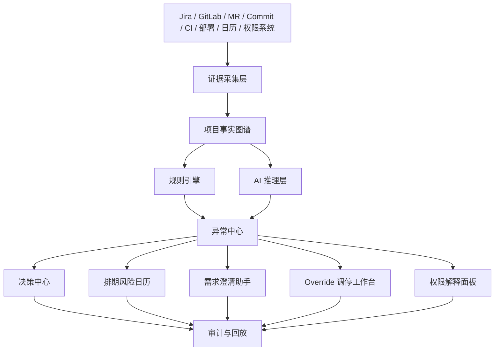

# 最强大脑改造计划交付文档

## 文档目的

这份文档把“最强大脑”的优化想法整理成可评审、可分派、可验收的改造计划。

改造重点不是让 AI 生成更多状态汇总，而是让系统持续维护项目事实、识别异常、暴露决策点，并把每一次 AI 建议、人工干预和权限判断都变成可追溯的证据。

## 一句话目标

把 well-ambient 从“项目看板 + AI 辅助”升级为“证据驱动的研发协同决策系统”。

目标状态：

> 系统维护事实，人处理判断。

团队不再每天靠人工追进度，而是在真正出现异常、冲突、缺口和需要决策的时候收到准确提醒。

## 改造范围

本次改造覆盖八个核心痛点。

| 痛点 | 改造方向 | 目标结果 |
| --- | --- | --- |
| 每天追进度 | 用 Git、Jira、MR、CI、部署证据自动判断状态，只推异常。 | 日常同步从逐项追问变成异常处理。 |
| 周会信息太散 | 自动生成“本周必须决策的问题”，不生成状态列表。 | 周会从状态会变成决策会。 |
| 需求描述不清 | AI 解构需求，读取系统设计语料库，输出缺失信息清单。 | 需求进入开发前先完成结构化澄清。 |
| 排期不可信 | 建立排期表、风险日历、截止日、停滞、二次延期预警。 | 排期从静态日期变成持续治理对象。 |
| Jira 与代码状态不一致 | 建立需求到 MR、commit、CI、部署的证据链。 | “完成”必须同时有状态和证据支撑。 |
| 人工转派被同步覆盖 | Override 变成有保护窗口、审计、回滚的调停工作台。 | 人工干预不会被外部同步静默覆盖。 |
| AI 建议不可追溯 | 每次 AI 输出保存 context_pack_id、来源、版本、置信度。 | 复盘时能还原 AI 当时看到的上下文。 |
| 权限问题难排查 | 做“为什么我能/不能操作”的权限解释面板。 | 管理员能快速定位权限问题。 |

## 产品原则

### 只推异常，不推正常

正常推进的需求不主动打扰人。系统只推送这些情况：

- 进度偏离计划。
- 证据链断裂。
- 需求信息不足。
- 排期进入风险区。
- 权限或同步出现冲突。
- 需要负责人、研发负责人或管理者拍板。

### 证据优先，AI 负责解释

AI 不直接成为真相源。真相来自 Jira、Git、MR、CI、部署、日历、权限系统、人工决策日志和历史记录。

AI 的职责是：

- 整理证据。
- 解释异常。
- 生成问题清单。
- 给出决策选项。
- 标注置信度。
- 记录建议依据。

### 人工干预必须可审计

转派、延期、优先级覆盖、同步保护和临时授权都不能只是一次字段修改。每次干预都要记录原因、影响范围、操作人、保护窗口、同步结果和回滚路径。

### 每个结论都能回放

系统给出的风险、建议、周会问题、权限解释和排期判断，都要能追溯到当时的证据、规则版本、AI 上下文包和人工操作。

## 目标架构



核心数据流：

1. 采集事实和证据。
2. 标准化成统一项目实体。
3. 建立需求、任务、代码、人员、时间、权限、决策之间的关系。
4. 规则引擎识别确定性异常。
5. AI 推理层解释复杂问题并生成建议。
6. 工作台推动人做决策和干预。
7. 审计层保存所有证据、建议和操作结果。

## 核心数据对象

### Requirement

表示业务需求或交付目标。

关键字段：

- `id`
- `title`
- `source`
- `owner`
- `status`
- `priority`
- `due_date`
- `readiness_score`
- `evidence_completeness`
- `risk_level`

### EvidenceChain

表示需求到代码和交付结果的证据链。

关键字段：

- `requirement_id`
- `jira_issue_keys`
- `branches`
- `merge_requests`
- `commits`
- `ci_runs`
- `deployments`
- `acceptance_records`
- `chain_status`
- `missing_links`

### DecisionQueueItem

表示需要人处理的异常或决策点。

关键字段：

- `id`
- `type`
- `severity`
- `title`
- `reason`
- `evidence_refs`
- `decision_owner`
- `deadline`
- `recommended_action`
- `status`

### ScheduleRisk

表示排期风险判断。

关键字段：

- `requirement_id`
- `planned_due_date`
- `delivery_probability`
- `risk_factors`
- `stale_days`
- `extension_count`
- `last_progress_at`
- `next_warning_at`

### ContextPack

表示 AI 运行时使用的上下文包。

关键字段：

- `context_pack_id`
- `model`
- `prompt_template_version`
- `source_versions`
- `selected_facts`
- `token_count`
- `content_hash`
- `confidence`

### AIOutputTrace

表示一次 AI 输出的可追溯记录。

关键字段：

- `id`
- `context_pack_id`
- `input_snapshot`
- `output`
- `sources`
- `model_version`
- `rule_version`
- `confidence`
- `created_at`
- `human_feedback`

### OverrideEvent

表示一次人工调停或覆盖。

关键字段：

- `id`
- `target_type`
- `target_id`
- `original_value`
- `override_value`
- `reason`
- `operator`
- `approver`
- `protection_window`
- `expires_at`
- `rollback_plan`
- `sync_conflict_status`

### AuthorizationDecision

表示一次权限判断。

关键字段：

- `subject`
- `action`
- `resource`
- `scope`
- `allowed`
- `matched_policy`
- `deny_reason`
- `missing_permission`
- `grant_path`

## 模块一：证据图谱

### 要解决的问题

现在很多项目状态依赖人工汇报。Jira、MR、commit、CI 和部署状态之间缺少统一解释，导致“看起来完成”和“实际交付完成”经常不一致。

### 改造内容

建立需求到交付结果的完整证据链：

```text
Requirement -> Jira Issue -> Branch -> Commit -> MR -> CI -> Deployment -> Acceptance
```

系统需要自动识别：

- 需求有 Jira，但没有代码证据。
- 代码已合并，但 Jira 状态未更新。
- Jira 标记完成，但 MR 未合并。
- MR 已合并，但没有部署记录。
- 已部署，但缺少验收记录。
- commit 或 MR 没有关联需求。

### 交付物

- 需求证据链页面。
- Jira-Code 对账报告。
- 证据完整度评分。
- 缺失证据提醒。

### 验收标准

- 每个需求能看到关联 Jira、MR、commit、CI 和部署证据。
- 系统能列出证据链缺口。
- 状态不一致能进入异常中心。

## 模块二：异常中心

### 要解决的问题

团队每天追进度的成本高，原因是系统没有主动告诉人哪些事情真的偏离了计划。

### 改造内容

异常中心只收敛需要人处理的问题。

异常类型：

| 类型 | 触发条件 | 默认处理人 |
| --- | --- | --- |
| `missing_schedule` | 需求进入执行流但没有排期。 | PM / 需求负责人 |
| `due_soon` | 截止日临近但证据链不完整。 | 需求负责人 |
| `overdue` | 已超过截止日。 | 研发负责人 |
| `stale_after_schedule` | 已排期但长时间无 Git、MR 或 Jira 推进。 | 负责人 |
| `evidence_missing` | 状态显示完成但缺少代码、部署或验收证据。 | 负责人 |
| `status_mismatch` | Jira、代码、MR、部署状态不一致。 | 研发负责人 |
| `context_missing` | 需求缺少进入开发所需信息。 | PM |
| `resource_conflict` | 负责人负载、依赖或优先级冲突。 | 研发负责人 |

### 交付物

- 异常中心列表。
- 每日异常摘要。
- 异常严重等级。
- 异常处理状态。
- 异常关闭原因。

### 验收标准

- 正常推进的需求不会出现在每日提醒里。
- 每条异常都有明确证据和处理人。
- 异常关闭必须填写处理结果或绑定系统证据。

## 模块三：周会决策中心

### 要解决的问题

周会信息散，容易变成每个人念状态。真正需要决策的问题反而被埋掉。

### 改造内容

系统每周生成“必须决策的问题”，而不是生成状态列表。

每张决策卡包含：

- 问题是什么。
- 为什么现在必须处理。
- 不处理会影响什么。
- 证据是什么。
- 可选方案有哪些。
- AI 推荐方案是什么。
- 需要谁拍板。
- 最晚决策时间。
- 会后跟踪动作。

决策类型：

- 是否延期。
- 是否拆分需求。
- 是否转派。
- 是否升级会议。
- 是否接受范围缩减。
- 是否挂起。
- 是否要求补充需求信息。
- 是否调整优先级。

### 交付物

- 周会决策面板。
- 决策卡。
- 决策记录库。
- 会后行动项。

### 验收标准

- 周会页面默认展示决策项，而不是所有任务。
- 每个决策项都有证据、选项和负责人。
- 会后可以看到决策是否执行。

## 模块四：需求澄清助手

### 要解决的问题

需求描述不清时，开发会在执行中反复确认，导致返工、延期和估算失真。

### 改造内容

AI 对需求进行结构化解构，并结合系统设计语料库生成缺失信息清单。

解构维度：

- 用户目标。
- 业务规则。
- 主流程。
- 异常流程。
- 权限规则。
- 数据字段。
- 接口影响。
- UI 影响。
- 依赖系统。
- 验收标准。
- 灰度方案。
- 回滚方案。
- 估算依据。

缺失信息分级：

- 必须回答：不回答不能进入开发。
- 可后置回答：可以开发，但有明确风险。
- 建议补充：有助于降低返工。

### 交付物

- 需求就绪度评分。
- 缺失问题清单。
- 验收标准草案。
- 类似历史需求推荐。
- AI 解构归档。

### 验收标准

- 每次 AI 解构都有 `context_pack_id`。
- 缺失问题能转成待办或评论。
- 需求就绪度低于阈值时会进入异常中心。

## 模块五：排期可信度与风险日历

### 要解决的问题

排期只记录日期，不代表可交付。团队需要知道“这个日期是否可信”。

### 改造内容

建立排期风险模型，持续计算交付概率。

风险因子：

- 距离截止日剩余天数。
- 最近 Git 活跃时间。
- MR review 耗时。
- CI 失败次数。
- 需求变更次数。
- 依赖未响应数量。
- 负责人当前负载。
- 历史估算偏差。
- 二次延期次数。
- 证据链完整度。

输出形式：

- 交付概率。
- 风险等级。
- 风险原因。
- 下一次预警时间。
- 建议动作。

### 交付物

- 排期治理表。
- 风险日历。
- 截止日预警。
- 停滞预警。
- 二次延期预警。

### 验收标准

- 每个已排期需求都有风险等级。
- 截止日前风险会提前暴露。
- 二次延期需求会自动升级严重等级。

## 模块六：Override 调停工作台

### 要解决的问题

人工转派、优先级覆盖和状态修改容易被外部同步覆盖，之后很难知道谁改了什么。

### 改造内容

把 Override 从“字段覆盖”升级成正式调停流程。

Override 生命周期：

```text
创建 -> 预检 -> 生效 -> 保护窗口 -> 同步冲突检测 -> 续期/合并/回滚 -> 归档
```

工作台能力：

- 显示原始值和覆盖值。
- 要求填写覆盖原因。
- 设置保护窗口。
- 预估影响范围。
- 检测外部同步冲突。
- 支持接受同步、保留人工覆盖、合并或回滚。
- 记录审计日志。

### 交付物

- Override 工作台。
- 冲突调停页面。
- 审计日志。
- 一键回滚入口。

### 验收标准

- 人工覆盖不会被同步器静默覆盖。
- 每次覆盖都有操作人、原因、时间和影响范围。
- 冲突发生时必须进入调停状态。

## 模块七：AI 可追溯

### 要解决的问题

AI 建议如果不能说明依据，就无法复盘，也无法建立团队信任。

### 改造内容

每次 AI 输出都记录完整追溯信息。

必须保存：

- `context_pack_id`
- 输入快照。
- 证据来源。
- 语料版本。
- 规则版本。
- 模型版本。
- prompt 模板版本。
- 置信度。
- 输出内容。
- 人工反馈。

支持回放：

- 查看 AI 当时看到的上下文。
- 查看输出引用了哪些证据。
- 查看规则版本和模型版本。
- 对 AI 建议标记“采纳、拒绝、部分采纳”。

### 交付物

- AI 输出回放页。
- Context Pack 浏览器。
- AI 建议反馈入口。
- AI 质量评估报表。

### 验收标准

- 所有 AI 输出都有可追溯记录。
- 任何一次 AI 解构都能还原上下文。
- 复盘时能统计 AI 建议采纳率和误判类型。

## 模块八：权限解释面板

### 要解决的问题

权限问题难排查，常见表现是用户只知道“不能操作”，管理员也很难快速判断问题来自角色、范围、策略还是资源状态。

### 改造内容

把权限判断解释成：

```text
subject + action + resource + scope + condition
```

解释面板展示：

- 当前用户是谁。
- 当前操作是什么。
- 操作对象是什么。
- 命中了哪条允许策略。
- 是否命中了拒绝策略。
- 缺少哪个角色或权限。
- 谁可以授权。
- 是否可以申请临时权限。
- 临时权限何时过期。

### 交付物

- 权限解释 API。
- 权限解释面板。
- 权限申请入口。
- 高风险授权审计日志。

### 验收标准

- 普通用户能看到可行动的拒绝原因。
- 管理员能看到完整策略命中过程。
- 高风险操作都有授权审计记录。

## 分阶段落地计划

### Phase 0：方案确认

目标：确认范围、优先级和验收口径。

交付物：

- 本交付文档。
- MVP 范围确认。
- 高风险动作清单。
- 数据源接入清单。

验收标准：

- 产品、研发、管理者对优先级达成一致。
- 明确第一期不做的功能。
- 明确每个模块负责人。

### Phase 1：证据链 MVP

目标：先让系统知道事实是什么。

建设内容：

- 接入 Jira、GitLab、MR、commit、CI 和部署数据。
- 建立 Requirement、EvidenceChain、DecisionQueueItem 基础模型。
- 生成需求证据链视图。
- 输出 Jira-Code 对账报告。

建议周期：2 到 3 周。

验收标准：

- 每个需求能看到证据链。
- 状态不一致能被识别。
- 证据缺口能进入异常中心。

### Phase 2：异常中心 MVP

目标：让系统替代日常追进度。

建设内容：

- 建立异常分类。
- 建立严重等级。
- 建立每日异常摘要。
- 建立异常处理流转状态。

建议周期：2 周。

验收标准：

- 每日提醒只包含异常。
- 每条异常都有证据和处理人。
- 处理后的异常可以关闭和复盘。

### Phase 3：周会决策中心

目标：把周会从状态同步改造成决策会议。

建设内容：

- 自动生成周会决策卡。
- 聚合阻塞、延期、状态不一致和资源冲突。
- 记录决策结果和后续行动项。

建议周期：2 周。

验收标准：

- 周会页面默认展示决策项。
- 决策项有选项、影响、证据和负责人。
- 会后行动项能回流到需求或异常。

### Phase 4：需求澄清与 AI 追溯

目标：让 AI 解构可复盘，让需求进入开发前更清楚。

建设内容：

- 建立系统设计语料库。
- 生成 Context Pack。
- AI 解构保存 `context_pack_id`。
- 输出缺失信息清单和需求就绪度评分。

建议周期：3 到 4 周。

验收标准：

- 每次 AI 输出都可追溯。
- 低就绪度需求会进入异常中心。
- 缺失信息能转化为待办或评论。

### Phase 5：排期可信度与风险日历

目标：从记录排期升级到治理排期。

建设内容：

- 建立排期风险模型。
- 计算交付概率。
- 建立风险日历。
- 接入截止日、停滞、二次延期预警。

建议周期：3 周。

验收标准：

- 已排期需求都有风险等级。
- 截止日前能提前预警。
- 二次延期能自动升级严重等级。

### Phase 6：Override 调停工作台

目标：让人工干预有保护、有审计、有回滚。

建设内容：

- 建立 OverrideEvent。
- 建立保护窗口。
- 建立同步冲突检测。
- 建立回滚和归档流程。

建议周期：2 到 3 周。

验收标准：

- 人工覆盖不会被同步静默覆盖。
- 冲突必须进入调停状态。
- 每次干预都能审计和回滚。

### Phase 7：权限解释与策略化 RBAC

目标：让权限判断可解释、可申请、可审计。

建设内容：

- 建立 policy evaluator。
- 提供权限解释 API。
- 建立权限解释面板。
- 记录高风险授权日志。

建议周期：3 周。

验收标准：

- 用户能知道为什么不能操作。
- 管理员能看到策略命中过程。
- 高风险权限变更都有审计。

## MVP 推荐范围

第一期建议只做能形成闭环的五件事：

1. 需求到代码的证据链。
2. Jira-Code 状态对账。
3. 每日异常中心。
4. 周会决策清单。
5. AI 输出可追溯。

暂缓内容：

- 复杂机器学习预测模型。
- 全量文档自动 ingestion。
- 多级审批流。
- 完整权限策略语言。
- 自动生成组织级绩效评价。

这样能先证明核心价值：减少人工追问，提升决策质量，让 AI 和系统判断可追溯。

## 关键页面

### 项目健康总览

展示项目层面的健康状态：

- 项目健康分。
- 高风险需求数量。
- 状态不一致数量。
- 证据链完整度。
- 本周必须决策事项。
- 交付风险趋势。

### 异常中心

展示所有需要处理的异常：

- 异常类型。
- 严重等级。
- 证据。
- 负责人。
- 建议动作。
- 截止处理时间。
- 当前处理状态。

### 周会决策面板

展示本周必须讨论的问题：

- 决策问题。
- 不处理的影响。
- 可选方案。
- AI 推荐方案。
- 拍板人。
- 后续行动项。

### 需求证据链页面

展示单个需求从描述到交付的证据：

- Jira 状态。
- 分支。
- commit。
- MR。
- CI。
- 部署。
- 验收。
- 缺失环节。

### 排期风险日历

展示未来一段时间的交付风险：

- 截止日。
- 交付概率。
- 停滞天数。
- 延期次数。
- 风险原因。
- 建议动作。

### AI 回放页

展示一次 AI 输出的完整上下文：

- 输入快照。
- Context Pack。
- 模型版本。
- 规则版本。
- 引用证据。
- 输出结果。
- 人工反馈。

### Override 调停工作台

展示人工干预和同步冲突：

- 原始值。
- 覆盖值。
- 操作原因。
- 保护窗口。
- 同步冲突。
- 审计记录。
- 回滚入口。

### 权限解释面板

展示一次权限判断：

- 当前用户。
- 操作。
- 资源。
- 范围。
- 允许策略。
- 拒绝策略。
- 缺失权限。
- 申请路径。

## 通知策略

通知要克制，避免把异常中心变成新的噪音源。

通知规则：

- P0 异常即时通知。
- P1 异常每日汇总。
- P2 异常只进入列表，不主动推送。
- 周会决策项在会前固定时间推送。
- 同一异常合并通知，不重复刷屏。
- 已分配处理人的异常只提醒相关人。

通知内容必须包含：

- 异常是什么。
- 为什么触发。
- 证据是什么。
- 谁需要处理。
- 建议动作是什么。
- 最晚处理时间。

## 成功指标

上线后用这些指标判断改造是否有效：

| 指标 | 期望变化 |
| --- | --- |
| 每周人工追进度次数 | 下降 |
| Jira 与代码状态不一致数量 | 下降 |
| 周会状态同步时间 | 下降 |
| 周会决策闭环率 | 上升 |
| 需求返工率 | 下降 |
| 二次延期率 | 下降 |
| 权限问题平均排查时间 | 下降 |
| AI 输出可追溯率 | 达到 100% |
| 异常关闭平均耗时 | 下降 |
| 证据链完整度 | 上升 |

## 主要风险与应对

| 风险 | 表现 | 应对 |
| --- | --- | --- |
| 数据质量不足 | Jira、MR、commit 没有关联关系。 | 先做证据缺口提示，再逐步推动规范。 |
| 通知变成噪音 | 异常过多，团队忽略提醒。 | 严格分级，默认只推 P0/P1。 |
| AI 建议被误当事实 | 团队直接采纳 AI 推断。 | UI 明确区分事实、证据、推断和建议。 |
| 排期概率不被信任 | 团队觉得模型黑盒。 | 先用规则解释风险因子，再逐步增强模型。 |
| Override 滥用 | 人工覆盖绕过正常流程。 | 高风险操作加权限、原因、审计和过期时间。 |
| 权限解释泄露敏感信息 | 普通用户看到过多策略细节。 | 普通用户看行动提示，管理员看完整策略。 |

## 实施分工建议

| 方向 | 主要职责 |
| --- | --- |
| 产品负责人 | 确认 MVP 范围、异常分类、周会决策卡格式和成功指标。 |
| 后端 | 数据模型、采集器、证据链、异常规则、权限解释、审计日志。 |
| 前端 | 异常中心、证据链页面、周会决策面板、风险日历、调停工作台。 |
| AI / 平台 | Context Pack、AI 输出追溯、需求解构、缺失信息生成。 |
| 运维 / 集成 | Jira、GitLab、CI、部署系统、通知渠道和权限系统接入。 |

## 第一批任务拆解

### 任务 1：定义统一证据模型

输出：

- Requirement 模型。
- EvidenceChain 模型。
- DecisionQueueItem 模型。
- ScheduleRisk 模型。

验收：

- 能用同一套模型表达 Jira、MR、commit 和部署证据。

### 任务 2：实现 Jira-Code 对账

输出：

- Jira 完成但无 MR 的列表。
- MR 合并但 Jira 未更新的列表。
- commit 无需求关联的列表。
- 部署缺少验收的列表。

验收：

- 至少识别 4 类状态不一致。

### 任务 3：实现异常中心

输出：

- 异常列表 API。
- 异常详情 API。
- 异常关闭 API。
- 异常中心 UI。

验收：

- 每条异常都有证据、处理人和建议动作。

### 任务 4：实现周会决策清单

输出：

- 周会决策卡生成规则。
- 决策列表页面。
- 决策记录归档。

验收：

- 能基于本周异常自动生成决策卡。

### 任务 5：实现 AI 输出追溯

输出：

- Context Pack 存储。
- AIOutputTrace 存储。
- AI 回放页面。

验收：

- 每次 AI 解构都能通过 `context_pack_id` 复盘。

## 不做什么

第一期明确不做：

- 不做全自动项目经理。
- 不让 AI 直接修改关键项目状态。
- 不做黑盒式交付预测。
- 不用 KPI 给个人排名。
- 不做无审计的权限临时放开。
- 不把所有历史文档一次性导入语料库。

## 最终交付判断

这次改造成功的标志不是页面变多，而是团队工作方式发生变化：

- 管理者不再每天追问正常需求。
- 周会主要处理决策，而不是同步状态。
- 开发者只收到和自己相关的明确异常。
- PM 能在开发前发现需求缺口。
- 研发负责人能提前看到排期风险。
- 管理员能解释权限问题。
- 所有人都能追溯 AI 建议从哪里来。

当这些能力形成闭环后，“最强大脑”才真正从 AI 助手升级为研发协同的操作系统。
