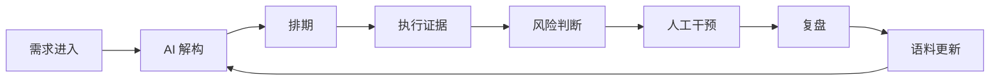

# 最强大脑分阶段落地计划书

## 审阅目标

这份计划把 well-ambient 的“最强大脑”方向收敛成可审阅、可分派、可验证的多 Phase 路线。

审阅时请重点判断三件事：

- 是否同意北极星目标：well-ambient 从“看板工具”升级为“研发协同的异常决策系统”。
- 是否同意 Phase 1 先校准横向边界，再进入子代理执行。
- 是否同意后续 Phase 按“事实证据 -> 决策队列 -> 排期治理 -> AI 语料 -> 人工干预 -> 权限与观测”的顺序推进。

在你审阅同意前，本计划只作为方案文件，不启动代码实施和子代理落地。

## 北极星

最强大脑不是让 AI 替人做所有判断，而是让系统自动收集事实、组织证据、暴露异常、生成建议，并把人从日常追问里解放出来。

目标状态：

> 系统维护事实，人处理判断。

well-ambient 应该让团队只在这些场景被打扰：

- 目标偏差：需求、排期、代码证据、验收结果已经偏离计划。
- 资源冲突：负责人、部门、项目优先级、截止日之间存在不可同时满足的约束。
- 风险取舍：继续推进、延期、转派、拆分、挂起、升级会议都需要人明确承担结果。
- 上下文缺失：需求描述、业务边界、验收标准、估算依据不足，AI 或系统无法可靠判断。
- 人工干预：系统建议不能直接生效，必须由有权限的人预检、确认、审计、必要时回滚。

## 现代范式

本计划采用八个现代产品和工程范式：

| 范式 | 在 well-ambient 中的含义 |
| --- | --- |
| Exception-driven workflow | 默认不打扰，只推红区、冲突、缺口和需要人拍板的问题。 |
| Evidence-based management | 进度判断基于 Jira、GitLab、MR、commit、排期和决策日志，不依赖主动汇报。 |
| Context registry | AI 需求解构使用可版本化、可审计、可缓存的系统设计语料包，而不是越来越长的 prompt 文本框。 |
| Event ledger | 需求、排期、同步、干预、通知、状态变更都留下事件轨迹，避免“谁覆盖了谁”无法解释。 |
| Read models | 写入层保留事实，前端看板、排期表、决策队列、KPI 预览使用面向读取的紧凑模型。 |
| Human-in-the-loop | AI 生成建议，人做最终取舍，系统记录依据、影响范围和结果。 |
| Intent-aware conversation | 系统先识别人的真实意图、缺失上下文和下一问，再进入解构、排期或调停动作。 |
| Policy-based authorization | 权限解释为 subject + action + resource + scope + condition，而不是只看粗角色。 |
| Product observability | 监控协同质量：延期率、停滞率、无证据完成率、估算偏差、干预有效率。 |

## 痛点需求打法

| 痛点 | 打法 | 结果 |
| --- | --- | --- |
| 每天追进度 | 自动汇总 Jira/GitLab/排期证据，只推异常。 | 日常同步从“逐项汇报”变成“异常处理”。 |
| 周会信息分散 | 生成决策队列：阻塞、延期、状态不一致、缺失信息、资源冲突。 | 周会从状态会变成决策会。 |
| 需求描述不清 | AI 解构读取系统设计语料库，输出缺失信息、验收标准、风险和依赖。 | 需求进入执行前先完成结构化澄清。 |
| 对话交互黑盒 | AI 先展示识别到的意图、置信度、摘要、缺失信息和下一问。 | 用户知道系统为什么追问，也能纠正意图。 |
| 排期不可信 | 排期表、风险日历、二次延期、无推进预警一起工作。 | 排期从静态日期变成持续治理对象。 |
| Jira 与代码不同步 | 建立需求、影子任务、Bug、branch、commit、MR、merge 的证据链。 | “完成”必须有状态和证据双重解释。 |
| 人工转派被同步覆盖 | Override 工作台记录本地干预、保护窗口、Jira 写回、审计和回滚。 | 人工调停不会悄悄失效。 |
| AI 建议不可追溯 | 每次 AI 输出保存 context pack、来源、版本、置信度和估算依据。 | 复盘时能重建 AI 当时看到的事实。 |
| 权限问题难排查 | 提供有效权限解释和授权决策日志。 | 管理员能看懂为什么能操作或为什么被拒绝。 |

## 总体 Phase 路线

| Phase | 名称 | 主要产物 | 是否进入代码实施 |
| --- | --- | --- | --- |
| Phase 1 | 横向边界校准与坚毅下一步计划 | 六个边界、异常分类、执行顺序、子代理分工、验收口径 | 否，审阅通过后才实施 |
| Phase 2 | 事实与证据底座 | 事件模型、证据链 DTO、异常分类 v1、读模型接口 | 是 |
| Phase 3 | 决策队列 MVP | 每日/周会异常队列、决策卡、跳转和处理状态 | 是 |
| Phase 3.5 | AI 意图识别与总结 | 对话意图、需求摘要、缺失信息、下一问、建议动作 | 是 |
| Phase 4 | 排期治理与风险日历 | 排期表、风险日历、延期/停滞/二次延期预警、通知接入 | 是 |
| Phase 5 | 系统设计语料库与 AI 闭环 | context registry、context pack、AI 解构归档、估算复盘 | 是 |
| Phase 6 | Override 调停工作台 | 操作预检、调停模板、审计事件、保护窗口、回滚入口 | 是 |
| Phase 7 | 权限解释与策略化 RBAC | policy evaluator、权限解释端点、高风险授权日志、管理 UI | 是 |
| Phase 8 | 产品观测与复盘循环 | KPI 预览、协同质量指标、复盘报告、语料自动候选更新 | 是 |

## Phase 1：横向边界校准与坚毅下一步计划

Phase 1 的目标不是写功能，而是把最强大脑的边界、优先级和执行纪律定牢。它决定后续子代理怎么拆、每个 Phase 的验收怎么判断，以及哪些需求暂时不做。

### 1. 角色边界

需要明确每类人的关注点和可操作范围。

| 角色 | 关心什么 | 应该看到什么 | 应该能做什么 |
| --- | --- | --- | --- |
| PM / 需求负责人 | 需求是否清楚、是否排期、是否延期、是否需要协调。 | 需求风险、排期状态、缺失信息、验收标准、负责人。 | 补充需求、调整优先级、发起排期、确认 AI 拆解。 |
| 研发负责人 | 资源是否冲突、任务是否停滞、代码证据是否闭环。 | 部门/负责人负载、停滞项、MR 状态、风险聚合。 | 转派、拆分、延期、升级会议、确认干预。 |
| 开发者 | 少被打扰，只处理自己真正要做的事。 | 自己相关的需求、任务、Bug、阻塞和明确下一步。 | 更新执行事实、补充说明、响应调停。 |
| 管理者 | 交付趋势是否健康，组织协同是否变好。 | KPI 预览、延期趋势、估算偏差、异常关闭率。 | 查看报告、追问高风险项、推动规则调整。 |
| 系统管理员 | 权限、集成、语料、通知是否可信。 | 授权解释、集成状态、语料版本、同步失败。 | 配置策略、维护语料、处理集成故障。 |

Phase 1 验收：

- 每个核心页面能说清楚主要服务哪个角色。
- 每个高风险动作能说清楚谁有权执行。
- 不再把所有人都当成同一种“看板使用者”。

### 2. 时间边界

系统要按不同时间尺度组织信息。

| 时间尺度 | 系统问题 | 产品形态 |
| --- | --- | --- |
| 日内 | 今天有哪些异常必须处理？ | 决策队列、即时通知、风险徽标。 |
| 每周 | 周会应该讨论什么？ | 周会异常简报、决策卡、处理结果。 |
| 迭代 | 计划和实际偏差在哪里？ | 排期治理、需求闭环、估算偏差。 |
| 月度/季度 | 协同能力有没有变强？ | KPI 预览、趋势报告、复盘摘要。 |

Phase 1 验收：

- 不再用一个看板承载所有时间尺度。
- 日内异常、周会决策、迭代复盘、长期趋势分别有明确入口或输出。

### 3. 数据边界

需要区分事实源、证据源、推断源和建议源。

| 数据类型 | 来源 | 用途 | 风险 |
| --- | --- | --- | --- |
| 需求事实 | Jira、本地需求、AI 导入、手工录入 | 判断需求是否存在、归属谁、处于什么状态 | Jira Task 在本部署中是需求，不能误当执行任务。 |
| 执行证据 | GitLab branch、commit、MR、merge | 判断是否真实推进 | commit 不能单独代表完成。 |
| 排期事实 | due date、负责人、branch、task group | 判断是否已排期和是否延期 | backlog 不等于已排期。 |
| AI 推断 | 解构结果、估算、风险、缺失信息 | 辅助拆解和决策 | 必须保留 context pack 才可复盘。 |
| 人工决策 | Override、转派、延期、挂起、会议结论 | 解释为什么偏离自动流转 | 需要审计和回滚。 |
| KPI 指标 | 聚合读模型、交付证据、风险事件 | 判断协同质量 | 不能只做完成量排名。 |

Phase 1 验收：

- 每个页面字段能标注来自事实、证据、推断还是建议。
- AI 建议不能覆盖事实，人工干预不能被同步器静默覆盖。

### 4. 流程边界

最强大脑主流程应收敛成一个闭环。



Phase 1 验收：

- 每个 Phase 都能挂到这条闭环上。
- 不属于闭环的功能先降级为后续扩展。
- 优先修通闭环，不先追求覆盖所有高级场景。

### 5. 干预边界

人工干预必须有明确约束。

| 干预类型 | 触发条件 | 系统动作 | 人的动作 |
| --- | --- | --- | --- |
| 转派 | 负责人无推进、资源冲突、风险升级 | 展示影响范围、通知对象、Jira 写回计划 | 确认新负责人和原因 |
| 延期 | 截止日已超、风险可接受但无法按期交付 | 展示延期次数、历史估算、影响需求 | 选择新日期并填写原因 |
| 拆分 | 需求过大、AI 判断拆解不足 | 给出拆分建议和验收标准 | 确认拆分边界 |
| 挂起 | 等待外部输入或优先级下降 | 记录挂起原因和恢复条件 | 确认恢复触发点 |
| 升级会议 | 多方冲突无法单人处理 | 生成会议议题和所需决策 | 选择参与人和目标结果 |

Phase 1 验收：

- 高风险干预提交前必须有预检。
- 干预后必须能看到同步结果、通知结果和审计事件。
- 最近一次关键干预必须有回滚设计。

### 6. 权限边界

权限要从“谁属于哪个组”升级为“谁在什么范围内能做什么”。

| 权限问题 | Phase 1 结论 |
| --- | --- |
| 谁能看需求？ | 至少按全局、项目、部门、负责人范围解释。 |
| 谁能改排期？ | 需求负责人、研发负责人或授权策略允许的人。 |
| 谁能执行 Override？ | 需要高风险动作权限，并记录审计。 |
| 谁能维护 AI 语料？ | 系统管理员或被授权的领域负责人。 |
| 谁能查看 KPI？ | 管理者、研发负责人、管理员，后续支持范围策略。 |
| 谁能解释权限失败？ | 管理员需要看到决策原因，普通人看到可行动提示。 |

Phase 1 验收：

- 每个高风险动作都有 action/resource/scope 定义。
- 未来 policy evaluator 的策略句式提前定好：谁，能做什么，在哪个范围，为什么。

### 坚毅下一步计划

Phase 1 结束时，必须产出一份可以直接交给子代理执行的实施包。这里的“坚毅”指执行纪律：先修通闭环，先让异常决策变快，先让事实可解释，不被功能扩张拖散。

Phase 1 的下一步计划如下：

1. 冻结异常分类 v1：
   - `missing_schedule`：需求缺少可追踪排期。
   - `due_soon`：截止日临近。
   - `overdue`：需求或任务已超期。
   - `stale_after_schedule`：排期后长时间无推进。
   - `evidence_missing`：完成状态缺少代码或 MR 证据。
   - `status_mismatch`：MR/Git 证据和 Jira/任务状态不一致。
   - `context_missing`：需求缺少 AI 解构所需上下文。
   - `resource_conflict`：负责人、部门容量或优先级冲突。
2. 冻结最小闭环：
   - 需求进入。
   - AI 解构。
   - 排期。
   - Git/Jira 证据回流。
   - 异常进入决策队列。
   - 人工干预并审计。
   - 复盘后更新语料。
3. 冻结第一批读模型：
   - `DecisionQueueItem`：给日内和周会使用。
   - `ScheduleGovernanceRow`：给排期表和风险日历使用。
   - `EvidenceChain`：给执行追踪和状态一致性判断使用。
   - `ContextPackTrace`：给 AI 复盘使用。
   - `OverrideAuditEvent`：给人工干预解释和回滚使用。
   - `IntentSummary`：给 AI 对话、需求澄清、调停预检和周会摘要使用。
4. 冻结执行顺序：
   - 先做事实和证据底座。
   - 再做决策队列。
   - 再把排期治理接入通知。
   - 再增强 AI 语料闭环。
   - 最后扩展权限解释和 KPI 复盘。
5. 冻结不做清单：
   - Phase 1 不做新 UI。
   - Phase 1 不接 embeddings。
   - Phase 1 不做复杂审批流。
   - Phase 1 不重构全部 RBAC。
   - Phase 1 不把 KPI 做成泛管理驾驶舱。
6. 冻结子代理入口：
   - 你审阅同意后，再启动子代理。
   - 子代理只执行被批准的 Phase。
   - 每个子代理必须输出 touched files、风险、验证结果和未完成项。
   - 主代理负责整合、冲突处理、最终验证和提交。

Phase 1 交付物：

- 本计划书审阅版。
- 六个横向边界确认结果。
- 异常分类 v1。
- 子代理分工表。
- Phase 2 实施任务包。

## Phase 2：事实与证据底座

目标：让系统能稳定回答“这件事真实发生了什么”。

主要产物：

- 统一事件语义：需求创建、AI 解构、排期、负责人变更、Jira 同步、GitLab 证据、MR 合并、人工干预。
- 证据链 DTO：把需求、影子任务、Bug、branch、commit、MR、merge 组织成可读结构。
- 异常分类计算器：按 Phase 1 的异常分类输出 risk level、reason、rank 和 evidence。
- 紧凑读模型接口：给决策队列、排期表、执行追踪复用。

验收标准：

- 一个需求能追溯到相关任务、Bug、Git 证据和状态差异。
- 一个异常能解释命中的规则和证据。
- 不改变现有 Jira/GitLab 同步主流程，只增加更清楚的读取和判断层。

建议子代理：

- Backend Evidence Agent：事件/证据 DTO 和查询聚合。
- Risk Rules Agent：异常分类和排序规则。
- Integration Review Agent：检查 Jira/GitLab 现有同步是否会覆盖证据。

## Phase 3：决策队列 MVP

目标：把“今天必须人处理的问题”从看板里提出来。

主要产物：

- 决策队列接口：按异常等级、负责人、项目、部门、时间排序。
- 决策卡：展示问题、证据、建议动作、影响范围、推荐负责人。
- 状态流转：未处理、处理中、已决策、已忽略、已升级会议。
- 周会模式：按项目/部门生成一组必须讨论的问题。

验收标准：

- 日常打开系统时，第一眼看到的是需要判断的问题，不是完整状态海洋。
- 每张决策卡能跳到需求、排期、证据或 Override。
- 已处理的问题不会重复打扰，除非新证据导致风险升级。

建议子代理：

- Backend Decision Agent：接口和聚合。
- Frontend Decision Agent：决策队列 UI。
- QA Agent：验证跳转、空态、加载态和权限态。

## Phase 3.5：AI 意图识别与总结

目标：修复“AI 对话像黑盒”的问题，让系统在进入需求解构、排期、调停或查询前，先把识别到的用户意图和下一步问题透明展示出来。

主要产物：

- 意图识别接口：输入单轮文本或多轮 messages，输出 `intent`、`confidence`、`summary`、`suggested_action`、`missing_context`、`next_questions`。
- 稳定兜底规则：AI 未启用时也能基于关键词和结构化规则识别需求解构、排期调整、风险查询、调停、总结、权限/配置等意图。
- AI 增强路径：AI 已配置时，可在规则结果基础上生成更自然的摘要和下一问，但不能覆盖事实字段。
- 对话可纠正 UI：用户能看到当前识别意图、置信度、缺失信息和下一问，必要时改写输入或选择正确意图。
- 总结输出：面向日内、周会和需求澄清生成短摘要，保留来源和限制。

验收标准：

- AI 未配置时，意图识别仍可返回可用结果。
- 用户能看见系统为什么继续追问，而不是只看到“AI 正在思考”。
- 总结必须区分事实、推断和建议，不能把建议写成已发生事实。
- 意图识别结果能被决策队列、AI 解构、Override 预检和周会摘要复用。

建议子代理：

- Intent Backend Agent：意图识别、总结 DTO、规则兜底和可选 AI 增强。
- Conversation Frontend Agent：对话输入、意图透明展示、缺失信息下一问。
- QA Agent：验证 AI 未配置、AI 配置失败、空输入、多轮输入和中文需求场景。

## Phase 4：排期治理与风险日历

目标：让排期从静态日期变成持续治理对象。

主要产物：

- 排期表：需求、负责人、部门、截止日、工时、交付证据、影子任务、风险、更新时间。
- 风险日历：按周/月展示 due soon、overdue、stale、reschedule repeated。
- 通知接入：系统内通知和飞书通知使用同一套风险事件。
- 二次延期记录：延期次数、原因、影响范围。

验收标准：

- `backlog` 不再被误解为已排期。
- 已排期必须同时具备负责人、截止日和可追踪执行线索。
- 逾期、临期、排期后无推进能进入决策队列或通知中心。

建议子代理：

- Schedule Backend Agent：排期读模型和风险事件。
- Schedule Frontend Agent：表格、日历和风险徽标。
- Notification Agent：SSE/飞书通知复用同一事件源。

## Phase 5：系统设计语料库与 AI 闭环

目标：让 AI 需求解构更可信、可复盘、可持续变好。

主要产物：

- 系统设计语料库：架构、功能边界、流程、估算口径、历史样本。
- Context pack 生成：按需求范围、关键词、事实类型、置信度和 token 预算组装。
- AI 解构归档：保存 context pack、模型、估算、缺失信息、风险、验收标准。
- 复盘入口：比较 AI 估算和实际交付，生成语料更新候选。

验收标准：

- 每次 AI 输出都能回答“它看到了哪些上下文”。
- 非研发人员能理解应该维护什么语料。
- 长文档不会直接塞进 prompt，而是被拆成可审计资料卡和上下文包。

建议子代理：

- AI Context Agent：语料模型、pack 选择和缓存。
- Deconstruction Agent：AI 解构集成和归档。
- Review Loop Agent：估算复盘和语料更新候选。

## Phase 6：Override 调停工作台

目标：让人工干预可预检、可解释、可审计、可回滚。

主要产物：

- 操作预检：提交前展示字段变化、通知对象、Jira 写回、风险等级。
- 调停模板：转派协助、仅延期、挂起等待、升级会议、拆分需求。
- 审计事件：记录操作者、原因、旧值、新值、影响范围、同步结果。
- 回滚入口：最近一次关键干预可恢复旧负责人、旧截止日或旧状态。
- 本地干预保护窗口：避免 Jira 背景同步立刻覆盖人工决策。

验收标准：

- 高风险干预没有原因不能提交。
- 干预执行后能看到同步成功、失败或待重试。
- 最近一次关键干预能被解释和回滚。

建议子代理：

- Override Backend Agent：审计、预检和回滚。
- Override Frontend Agent：调停工作台 UI。
- Sync Guard Agent：Jira/GitLab 同步覆盖保护。

## Phase 7：权限解释与策略化 RBAC

目标：让权限从粗角色矩阵升级为可解释策略。

主要产物：

- Policy evaluator：兼容现有 group permissions，同时支持 allow/deny policy。
- 权限解释端点：说明允许或拒绝的原因、命中的策略、缺失权限和范围。
- 高风险授权日志：记录 Override、配置、语料维护、权限变更等动作。
- 管理 UI：用“谁能做什么，在哪个范围，为什么”的句式维护策略。

验收标准：

- 现有权限行为不被破坏。
- 显式 deny 能覆盖 legacy allow。
- 管理员能诊断一个用户为什么不能执行某个动作。

建议子代理：

- Auth Backend Agent：策略模型和 evaluator。
- Settings UI Agent：权限解释和策略管理。
- Security QA Agent：拒绝、覆盖、兼容和审计测试。

## Phase 8：产品观测与复盘循环

目标：把最强大脑从功能系统变成可持续改进的协同系统。

主要产物：

- KPI 预览：交付量、延期率、停滞率、状态不一致率、无证据完成率。
- 估算偏差：AI 估算、人工调整、实际交付周期的对比。
- 干预有效率：转派、延期、挂起、升级会议后的风险关闭情况。
- 复盘报告：按项目、部门、负责人、需求类型输出协同问题。
- 语料候选更新：从复盘中生成系统设计语料库更新建议。

验收标准：

- KPI 不只排名，而是解释交付质量和协同健康。
- 复盘能反哺 AI 语料和风险规则。
- 管理者看到趋势，执行者看到可行动问题。

建议子代理：

- Metrics Backend Agent：指标聚合和趋势。
- Report Frontend Agent：KPI 预览和复盘 UI。
- Corpus Feedback Agent：语料候选更新。

## 子代理落地方式

审阅通过后，建议按 Phase 启动子代理，而不是一次并行所有工作。

执行节奏：

1. 主代理拆出 Phase 2 实施任务包。
2. 启动 2 到 3 个边界清晰的子代理。
3. 每个子代理只改自己的模块，输出文件清单、验证命令、风险和未完成项。
4. 主代理合并结果，处理冲突，跑整体验证。
5. 通过后提交，并进入下一个 Phase。

子代理通用交付格式：

```markdown
## Scope

## Touched files

## Decisions

## Validation

## Risks

## Follow-ups
```

## 审阅决策点

请审阅并确认以下问题：

1. 是否同意“异常决策系统”作为 well-ambient 的最强大脑北极星？
2. 是否同意 Phase 1 只做边界校准和实施包，不写功能代码？
3. 是否同意六个横向边界作为后续执行约束？
4. 是否同意先做事实与证据底座，再做决策队列和排期治理？
5. 是否同意 AI 语料库、Override、权限解释、KPI 复盘按后续 Phase 推进？
6. 是否同意审阅通过后通过子代理按 Phase 落地？

## 同意后的第一步

如果你同意，本计划的下一步不是直接铺开所有功能，而是启动 Phase 2 的小闭环：

- 定义 `DecisionQueueItem`、`ScheduleGovernanceRow`、`EvidenceChain` 三个读模型。
- 梳理现有 Jira/GitLab/TaskTelemetry 数据能支撑哪些异常分类。
- 实现一个最小异常队列，让系统先能稳定回答“今天有哪些问题必须人处理”。
- 验证后再扩展排期治理、AI 语料和 Override。
